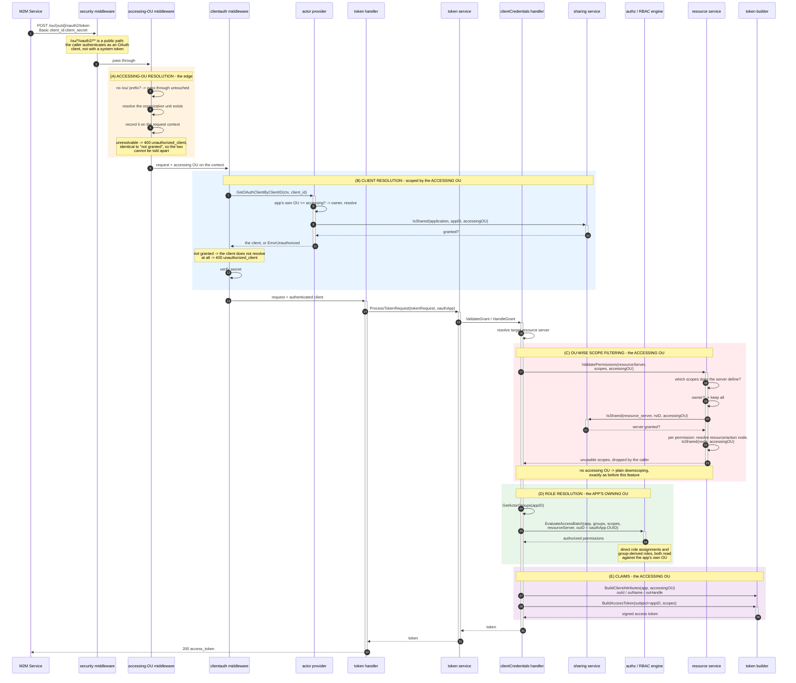
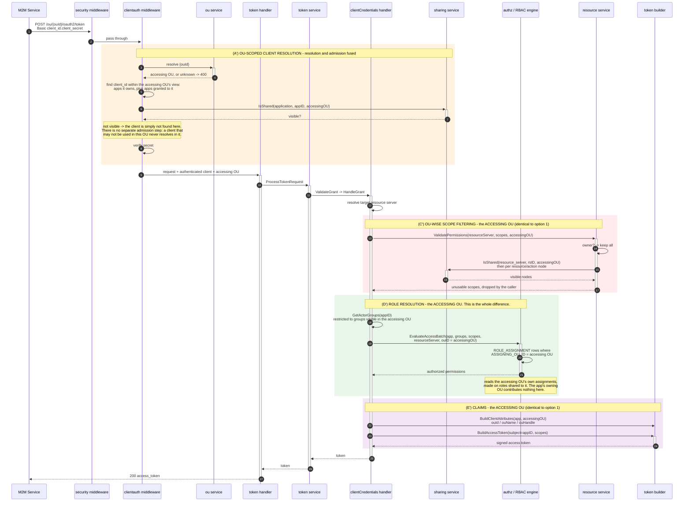

# M2M Application Sharing Across Organization Units - Design

How the `client_credentials` grant issues a token **for** one organization unit using an application
**owned by** another, and exactly where in the request each organization unit gets consulted.

Two designs are documented. §4 is the one implemented: entitlement resolved from the application's
owning organization unit, narrowed by the accessing one. §5 is the alternative: the accessing
organization unit resolves everything, including entitlement, from what was shared to it. §6 lists
what each needs in place, and §7 compares them.

Companion documents: [B2B_SHARING_DESIGN.md](B2B_SHARING_DESIGN.md) for the generic sharing
framework this reuses, [B2B_RESOURCE_SHARING_DESIGN.md](B2B_RESOURCE_SHARING_DESIGN.md) for the
resource-server grants the scope filter reads, and
[m2m-app-sharing/](m2m-app-sharing) for the Postman collection and setup guide.

## 1. Problem

A machine-to-machine service (a reconciliation job, a bot, a CLI) has to act on behalf of many
customer organizations. Registering one application per customer does not scale: credentials
multiply, rotation becomes a fan-out, and the service's own operators end up managing an application
inventory that mirrors the customer list. The service also must not become visible to the delegated
administrators of the organizations it serves, or those administrators could edit or delete it.

What is needed is one credential pair, a token that names the organization it is for, and a scope
set bounded by what that organization actually granted.

## 2. The three organization units in one request

This is the whole design. A single token request involves three distinct organization-unit roles,
and conflating any two of them produces a wrong answer:

| Question | Answered by | Consequence of getting it wrong |
|---|---|---|
| May this application be used here at all? | the **accessing** OU's grant *of the application* | either the service cannot serve anyone, or any organization can borrow anyone's service |
| What is this application entitled to? | the **application's owning** OU, via its roles and group memberships | resolving this per accessing OU would require duplicating the service's roles into every customer organization |
| What may the token actually carry? | the **accessing** OU's grants *of resource servers* | the token would carry permissions the customer organization never granted |
| Which organization is this token for? | the **accessing** OU (`ouId` / `ouName` / `ouHandle` claims) | a gateway could not tell which tenant's data the token is scoped to |

Entitlement is deliberately **not** re-resolved per accessing organization unit. The application's
roles live where the application lives. The accessing organization unit can only ever *narrow* the
result, never widen it, which is what makes the blast radius of a grant bounded and auditable.

The second row is the single axis the two designs disagree on. Option 2 (§5) answers it with the
**accessing** OU instead, via roles shared into that organization unit and assigned there. Every
other row is answered identically by both.

## 3. Request shape

```
POST /ou/{ouId}/oauth2/token      # token scoped to the named organization unit
POST /oauth2/token                # unchanged: no grant consulted, no filtering
```

The prefix is optional and additive. An empty accessing OU short-circuits every decision below, so
every pre-existing integration behaves exactly as before. That is enforced by construction rather
than by convention, and in one place rather than several: without the prefix the edge middleware
passes the request through untouched, so nothing is ever recorded on the context and every later
`GetAccessingOUID(ctx)` returns `""`.

The request shape is common to both options. Nothing a client sends distinguishes them; they differ
only in what the server consults once the organization unit has been read.

## 4. Option 1: entitlement from the application's owning OU (implemented)



### The same five points, as code anchors

| | Decision | OU used | Where |
|---|---|---|---|
| A | Accessing-OU resolution | **accessing** | `token/accessing_ou.go:33` - `accessingOUMiddleware`, wired at `token/init.go:73` |
| B | Client resolution *and* admission | **accessing** | `actorprovider/service.go:71` - `GetOAuthClientByClientID` → `requireUsableInAccessingOU` |
| C | Scope filtering | **accessing** | `client_credentials.go:89` - `DownscopeToResourceServer(… GetAccessingOUID(ctx))` |
| D | Role and group resolution | **app owning** | `client_credentials.go:115` - `EvaluateAccessBatch(… oauthApp.OUID)` |
| E | Claims | **accessing** | `client_credentials.go:134` - `BuildClientAttributes(… GetAccessingOUID(ctx))` |

A, B, C and E are the new decisions. D is untouched: it passes `oauthApp.OUID` exactly as it did
before this feature existed.

Note what is *not* in this list any more: the client credentials grant handler performs no
accessing-OU admission of its own. By the time a grant handler runs, an unresolvable organization
unit has already been refused at the edge (A) and a client with no standing in it has already failed
to resolve (B), so the handler only ever sees a request that is allowed to be there. Each layer owns
exactly one question, and none of them can be forgotten by a future grant type that adopts the
prefix: A and B sit in the shared request path rather than in any one handler.

## 5. Option 2: entitlement from the accessing OU (alternative, not implemented)

The alternative treats `/ou/{ouId}` as a genuine context rather than a filter applied late. The
organization unit named on the path is resolved first and every subsequent lookup runs inside it:
the client is searched for within that organization unit's view, and entitlement is resolved from
the assignments *that* organization unit made, on roles it was granted. Once the client has
resolved, the application's owning organization unit stops being an input to any later answer.

Put plainly: option 1 says *the service decides what it can do, the customer decides what it may
see*. Option 2 says *the customer decides both*.



### What actually changes

Only two of the five points move. C and E are already resolved against the accessing organization
unit and would not be touched.

| | Option 1 (implemented) | Option 2 |
|---|---|---|
| A | Client resolved globally, OU never consulted | Client resolved **inside the accessing OU's view** |
| B | Separate admission step, `unauthorized_client` | **Folded into A**: not visible means not found |
| C | Accessing OU | Accessing OU (**unchanged**) |
| D | App's **owning** OU | **Accessing** OU, via its own shared assignments |
| E | Accessing OU | Accessing OU (**unchanged**) |

### Why fusing A and B is not a free simplification

Collapsing admission into resolution reads as tidier, and it is, but it changes two things that are
currently deliberate.

It changes the refusal. Today a granted-but-unentitled caller gets `unauthorized_client` and a bad
secret gets `invalid_client` (see §8.4). Under option 2, an ungranted organization unit produces "no
such client", which is `invalid_client`: indistinguishable from a wrong secret. That is arguably
better for enumeration resistance and worse for diagnosability, and it is a behaviour change either
way.

It also needs a lookup that does not exist. `IdentifyEntity({"clientId": …})` is scoped by
`DEPLOYMENT_ID` alone (`backend/internal/entity/store_constants.go:457`), so "search within this
organization unit" has to be composed from the client lookup plus an ownership check plus
`ListSharedResourceIDs(application, accessingOU)`. Composed that way, it is exactly option 1's A
followed by option 1's B, with the error mapping changed. The lookup only becomes genuinely
different if `client_id` uniqueness is relaxed from deployment-wide to per-organization-unit, which
is a much larger change: uniqueness is enforced today by a service-layer check
(`applicationService.isIdentifierTaken`, `backend/internal/application/service.go:998`) over that
same deployment-scoped query, with no supporting database constraint.

## 6. Prerequisites

Both options need the same setup on the resource side and differ entirely on the entitlement side.
"Per customer" below means the work repeats for every organization unit the service acts for, which
is the axis that decides how each option scales.

### 6.1 Common to both options

| Prerequisite | Set up by | Repeats per customer? |
|---|---|---|
| The accessing OU exists and resolves | platform | no |
| The application is granted to the accessing OU (`resource_type: application`, `grants:`) | the service's owning OU | once per grant, but a subtree or `allOus` grant covers many at once |
| The resource server is shared to the accessing OU | the resource server's owning OU | yes |
| The specific resource / action nodes backing each requested permission are visible to the accessing OU, that is, not carved out by `excludedNodeIds` | the resource server's owning OU | yes |
| Each requested scope is a permission actually defined on the target resource server | resource server owner | no |
| The caller uses the `/ou/{ouId}` prefixed token endpoint | the M2M service | no |

### 6.2 Option 1 only

| Prerequisite | Set up by | Repeats per customer? |
|---|---|---|
| A role exists in the application's owning OU carrying the permissions the service may ever exercise | the service's owning OU | **no** |
| That role is assigned to the application with `ASSIGNING_OU_ID` = the application's owning OU | the service's owning OU | **no** |

That is the whole entitlement setup, and it is done once for the service's lifetime. A new customer
organization unit needs only the two resource-side grants from §6.1.

### 6.3 Option 2 only

| Prerequisite | Set up by | Repeats per customer? | Exists today? |
|---|---|---|---|
| A role carrying the permissions is **shared** to the accessing OU | the role's owning OU | yes | yes, `role` is registered with the sharing framework (`backend/internal/role/init.go:73`) |
| That grant makes assignments editable by the sharee: `assignments.app`, or the blanket `assignments` key | the role's owning OU | yes | yes (`backend/internal/role/resource_type_declaration.go:73`) |
| The accessing OU assigns the shared role to the application entity, with `ouId` set **explicitly** to itself | the customer's admin | yes | partly: nothing rejects assigning an entity owned by another OU, but a blank `ouId` defaults to the *assignee's* own OU (`assignment_service.go:554`), which is the application's owner, and `requireOwnOUScope` (`role/authz.go:22`) then refuses it. A blank `ouId` therefore fails confusingly rather than doing the obvious thing |
| Group-derived entitlement resolves inside the accessing OU | the customer's admin | yes | **no.** `internal/group` registers no `ResourceTypeDeclaration` with the sharing framework, unlike `role`, `application`, `resource_server`, `resource` and `action`, and a group is owned by exactly one OU (`group/model.go:50`). Either the accessing OU must be able to place a foreign application into one of its own groups, or group sharing has to be built first |
| The `roles` claim is scoped to the accessing OU | platform | no | **no.** `GetActorRoles(appID, groupIDs)` resolves through `GetUserRoles(ctx, entityID, groupIDs)`, which takes no OU. Under option 2 that claim would list role names assigned by *every* customer that assigned one, leaking one tenant's role vocabulary into another tenant's token |
| Revoking the application grant removes that OU's assignments for it | platform | no | **no.** `application` declares no `SharingHooks` (`application/resource_type_declaration.go`), deliberately, because option 1 stores nothing per (application, OU). Option 2 does, so it needs the `OnUnshare` cleanup `role` already implements (`role/resource_type_declaration.go:86`) |
| Client lookup is OU-aware | platform | no | **no**, see §5 |

## 7. Comparing the two options

### 7.1 Where they genuinely differ

Everything in the table below follows from one decision: **which organization unit's role
assignments answer "what is this application entitled to".**

| | Option 1 | Option 2 |
|---|---|---|
| Who sets the ceiling | the service's operator, once | each customer, independently |
| Who narrows it | each customer, via resource-server grants | the same customer, via the same resource-server grants, which is now a second lock on a door they already hold the key to |
| Customer's maximum influence | can only *narrow* what the service already has | can *define* what the service has, in their organization |
| Entitlement storage | none per (app, OU) | one assignment set per (app, OU) |

### 7.2 Pros and cons

| Dimension | Option 1 (implemented) | Option 2 |
|---|---|---|
| **Onboarding a customer** | Two resource-server grants. No entitlement work at all. Fastest path to a working tenant. | A role share, an editable-fields policy, and a role assignment naming a foreign application, by an admin who has never seen that application. Slowest path, and the one most likely to be got wrong. |
| **Service operator experience** | One role, set once. Adding a capability to the service is one edit. | Adding a capability means every customer must assign it. The service operator cannot ship a new feature without a fan-out they do not control. |
| **Customer admin experience** | Nothing to manage, which is also the complaint: a customer cannot express "this service may read but not write in my organization" except by withholding a whole resource or action. | Full local control, expressed in the vocabulary they already use for their own users. Attractive where customers expect to govern third-party access themselves. |
| **Security: blast radius** | Bounded by construction. The token can never exceed the intersection of what the service was given and what the customer granted, so a mistake in one customer's configuration cannot widen another's token. | A customer can grant the service anything the role share allows, in their own organization. Blast radius is per customer rather than global, but it is set by the party with the least context about what the service actually needs. |
| **Security: least privilege** | Coarse. The service carries its union of capabilities everywhere and relies on resource grants to trim. | Genuinely per tenant, which is the strongest argument for this option. |
| **Security: leakage** | The `roles` claim reflects the service's own roles, which are the service operator's own names. Nothing cross-tenant. | The `roles` claim leaks across tenants unless OU scoping is added first (§6.3). Until that is fixed this is a correctness defect, not a preference. |
| **Failure mode when misconfigured** | Token issues with fewer scopes than asked. Quiet, debuggable from the grant graph. | Token issues with **no** scopes, because the customer never made an assignment. Indistinguishable at the client from "not granted", and the fix lives in a different organization's console. |
| **Auditing "what can this service do"** | One query against the service's own OU answers it for the whole deployment. | Requires walking every accessing OU's assignments. There is no single answer, by design. |
| **Development time** | Done. | Material. OU-aware client lookup, OU-scoped `roles` claim, group sharing or a cross-OU membership model, `OnUnshare` cleanup for applications, plus the error-mapping change in §5. Group sharing alone is a feature in its own right. |
| **Long-run maintenance** | Low. Nothing is persisted per (app, OU), so revoking a grant is complete on its own and takes effect on the next token. | Higher. Every (app, OU) pair carries state that must be cleaned up on unshare, reconciled on export/import, and reasoned about whenever either side's grants change. |
| **Backward compatibility** | Additive. An empty accessing OU short-circuits every new decision, so the bare endpoint is untouched. | Also additive on the bare endpoint, but it changes the refusal for an ungranted OU from `unauthorized_client` to `invalid_client`, which is observable to existing OU-scoped callers. |
| **Scales with** | number of resource servers the service touches | number of customers **times** number of capabilities |

### 7.3 When option 2 would be the right answer

This is not a strict ordering, and the two are not mutually exclusive in the long run. Option 2 is
the better model when customers are the natural authority on what a third-party service may do
inside their organization, for example a marketplace of independent integrations where the platform
has no opinion about what any one of them should be allowed. Option 1 is the better model when the
service is the platform's own, its capabilities are uniform across customers, and the customer's
legitimate interest is limiting exposure rather than defining behaviour. The M2M reconciliation
service in §1 is squarely the second case, which is why option 1 was implemented.

A later hybrid is possible without rework: option 2's resolution can be added as a *second*
narrowing step rather than a replacement, intersecting the accessing OU's assignments with the
owning OU's rather than substituting for them. That keeps option 1's bounded blast radius and adds
option 2's per-tenant control, at the cost of requiring both sides to be configured. Nothing in the
implemented design forecloses it: point D already takes an OU parameter
(`AccessEvaluationRequest.OUID`), so a second evaluation against the accessing OU is an additional
call, not a restructuring.

## 8. Design decisions, and what each one rules out

### 8.1 The accessing OU rides on the context, set once at the edge

The accessing OU is read from the path exactly once, by `accessingOUMiddleware`
(`backend/internal/oauth/oauth2/token/accessing_ou.go`), and recorded on the request context via
`syscontext.WithAccessingOUID`. Everything downstream — client resolution, scope filtering, claims —
reads it back with `GetAccessingOUID(ctx)`. Both route patterns register the identical chain; the
OU-scoped one differs only in that the path value is present.

**This reverses an earlier decision in this document**, and it is worth saying why rather than
quietly editing it. The first version put the value on `model.TokenRequest` as an `AccessingOUID`
field, on the grounds that nothing outside the OAuth2 layer needed it and a context value would make
the dependency invisible. That stopped being true once admission moved into client resolution (§8.2):
the client resolver needs the organization unit *before* a `TokenRequest` exists, and it lives in
`internal/actorprovider`, outside the OAuth2 layer entirely.

Keeping both would have been strictly worse than either — two copies of one fact, free to disagree.
The field was removed.

### 8.2 Admission belongs to client resolution, not to a grant handler

Point B resolves the application and decides whether it may be used in the named organization unit
in the same step: `actorprovider.GetOAuthClientByClientID` consults the accessing OU from the
context and, for anything other than the application's own organization unit, asks whether it has
been granted there. A client with no standing simply does not resolve.

**This also reverses an earlier decision here.** The first version kept resolution deliberately
OU-independent and made admission a separate check inside the client credentials grant handler. The
reasoning was that a scoped *lookup* would force an application to exist in every organization it
serves, which is the per-customer registration this feature exists to avoid.

That reasoning still holds, and this design does not violate it: the lookup is still global and
there is still exactly one registration. What is scoped is not *finding* the application but
*admitting* it. Doing that during resolution rather than after has two concrete benefits. Every
OAuth path that resolves a client inherits the rule, instead of each grant handler having to
remember to ask — only `client_credentials` ever did. And the dependency stops being an engine
provider interface: `ApplicationOUAccessProvider` was removed from
`pkg/thunderidengine/providers` in favour of a consumer-declared internal interface, which is where
a management-side concern belongs. The embeddable engine hosts no application management and was
passing `nil` for it, which was the tell.

The refusal stays `unauthorized_client` rather than becoming an `invalid_client`-shaped
"no such client" — see §8.4. That is deliberate: the natural consequence of failing at resolution
would have been the latter.

### 8.3 The accessing OU is resolved before its grant is consulted

Existence is settled at the edge (A), before client resolution (B) consults any grant. That ordering
is load-bearing rather than defensive: `allOus` is a blanket scope that matches every organization
unit without consulting the tree, so a grant check alone cannot reject an id that names nothing.
Before the existence check existed, an unknown id under an `allOus` grant passed admission and then
failed deep inside claim resolution as a 500.

The check sits in its own middleware rather than in a grant handler because it is a property of the
*request*, not of any one grant type — and because resolution needs the organization unit to be
settled before it can scope anything by it. One consequence to be aware of: it therefore runs before
client credentials are verified, so an unknown organization unit can be probed without valid
credentials. The response is byte-identical to the one an *ungranted* organization unit gets, which
is what stops that being an enumeration primitive. Note this ordering is not new with the middleware:
the grant check already preceded secret verification once it moved into client resolution.

### 8.4 Refusal is `unauthorized_client`, not `invalid_client`

The client authenticated successfully; it simply has no grant for the organization unit it asked
for. `invalid_client` would misdescribe that, and would make a grant failure indistinguishable from a
bad secret. This also matches how the token service already reports a client that may not use a given
grant type. Enumeration is not a concern here: a caller holding valid credentials can only enumerate
its own application's grants.

Note the status code is **400**, not the 401 RFC 6749 §5.2 suggests for `invalid_client`. That is the
existing behaviour of this token endpoint, which maps every grant-handler error except `server_error`
to 400; this feature did not change that shared mapping.

### 8.5 Applications declare no templated fields

`applicationTypeDeclaration`
(`backend/internal/application/resource_type_declaration.go:18`) registers `application` with the
sharing framework and declares `TemplatedFields()` empty, with no `SharingHooks`.

An application's configuration (credentials, flows, allowed grant types) is global to the
application, not per-OU state layered on a shared definition. What genuinely varies per organization
unit is which permissions the resulting token may carry, and that is derived at issuance time from
resource-server grants rather than stored against the application. Because nothing is persisted per
(application, OU), an organization unit losing access has nothing to clean up: revoking the grant is
sufficient on its own, since the grant is consulted on every request rather than snapshotted.

### 8.6 Granting an application does not expose it

A grant permits an organization unit to be *named* as the accessing OU. It does not place the
application in that organization unit's listings, and does not make it editable or deletable there.
This is what satisfies the "M2M services remain invisible within granted organizations" requirement:
the delegated administrator of a customer organization has no view of the service acting on its
behalf.

### 8.7 Application sharing is declarative-only

There is deliberately no REST surface for application grants yet. Grants are declared in the
application's YAML and replayed at load time through the same `Share()` a programmatic call would
use, so a declared grant passes exactly the eligibility checks an API-created one would. The replay
is idempotent: declarative loading runs on every startup and `Share()` does not deduplicate, so an
already-present grant is skipped rather than appended again.

```yaml
resource_type: application
id: decl-m2m-all-ous
ouId: decl-m2m-root
grants:
  - allOus: true
```

The grant entry takes the same target-scope shape as role and resource-server grants, minus the
fields that only make sense for a tree-shaped resource: an application has no descendants to cascade
to and no templated fields, so there is nothing to exclude from a cascade and nothing to make
editable.

## 9. Worked example

An organization `Root` owns a reconciliation service granted to its whole subtree, and a resource
server whose `books` and `orders` resources it grants to `ChildA` with `orders` withheld. The
service's role, in `Root`, carries every permission.

| Request | Admission (B) | Filter (C) | Entitlement (D) | Scopes issued |
|---|---|---|---|---|
| `/oauth2/token` | skipped | skipped | `books:read books:create orders:read` | all three |
| `/ou/Root/…` | owner, allowed | owner sees its own server whole | same | all three |
| `/ou/ChildA/…` | subtree grant | `orders` not granted | same | `books:read books:create` |
| `/ou/ChildB/…` | subtree grant | server not granted | not reached, no scopes left | none |
| `/ou/Other/…` | **refused** | - | - | - |

The third row is the point of the feature: same credential, same role, same requested scopes, and a
narrower token, because the accessing organization unit was never granted `orders`.

Note the fourth row. `ChildB` is admitted (the *application* is granted to the whole subtree) but
receives no scopes (the *resource server* was granted only to `ChildA`). Admission and entitlement
are independent axes: being allowed to ask for a token is not being entitled to anything in it.

## 10. Interaction with resource-server exclusions

Point C resolves each requested permission to the specific resource or action node that defines it,
then asks whether that node is visible to the accessing organization unit. This has a consequence
for `excludedNodeIds` on a cascade share: excluding a node must exclude its whole subtree, because a
permission names an *action*. Withholding a resource while still granting the actions beneath it
would leave every one of its permissions visible, which is the opposite of what excluding it asked
for. See `expandExcludedNodes` in `backend/internal/resource/sharing.go`.

## 11. Alternatives considered

| Alternative | Why rejected |
|---|---|
| Resolve the accessing OU from a request parameter (`?ouId=` or a form field) instead of a path prefix | A path prefix makes the organization unit part of the resource identity, so it is visible in access logs, routable at a gateway, and cannot be silently dropped by a client library that mishandles form encoding. It also keeps the bare endpoint byte-identical rather than adding an optional parameter to it. |
| Resolve entitlement against the accessing OU rather than the app's owning OU | This is option 2, written up in full at §5 rather than dismissed here: it is a coherent design with a real constituency, not a mistake. Rejected **for this feature** because it moves per-customer administration back in, and lets a customer organization grant the service *more* than its owner intended. See §7.2 for the trade-offs and §7.3 for when it would be the right answer instead. |
| Scope the client *lookup* by the accessing OU | Rejected as a *replacement* for the global lookup: the application would have to exist in every organization it serves, which makes "one credential pair" impossible. Note this is not what §8.2 does — there the lookup stays global and only admission is scoped, so there is still exactly one registration. Option 2's A' (§5) is a weaker version that restricts *visibility* to the accessing OU; that version is viable, but as §5 shows it decomposes into the existing lookup plus admission unless `client_id` uniqueness also becomes per-organization-unit. |
| Filter scopes inside the RBAC engine rather than outside it | The engine answers "is this subject entitled to this permission", which is a property of the subject and its own organization unit. Visibility is a property of the accessing organization unit. Merging them would make the engine's answer depend on a caller-supplied OU, and would push sharing knowledge into a component that has none today. |
| Add a dedicated scope-filtering method beside `ValidatePermissions` rather than an OU parameter on it | Two methods make the unfiltered one reachable, and a caller that forgets the second has silently skipped an authorization check with nothing in its signature to say so. One method with an OU parameter makes "no organization unit applies here" an explicit, greppable argument instead of an omission. |
| Share the roles and groups separately, and share the application's *assignment* to them too | The application would stay unshared; what travels to the customer organization is the role (or group) plus the assignment binding the application to it, each shared through the framework in its own right. Rejected on three counts. **The parent application's assignments could differ per organization** — the same credential would carry a different permission set depending on which customer's copy of the assignment resolved, so "what can this service do" would have no single answer, and the owner would lose the guarantee that it defines the service's ceiling. **The sharing UX is poor**: granting one service to one customer becomes three coordinated grants (role, group, assignment) that must be kept consistent by hand, where the whole point of this feature is that an operator grants *the application* and everything else follows. And **group sharing is mostly unnecessary in a B2B context** — groups exist to collect principals inside one organization, whereas here there is exactly one principal, the service application, and it already resolves its permissions from its own organization unit. Sharing groups adds a mechanism with no B2B constituency, in support of a model that weakens the ceiling guarantee. |
| Store the granted scope set per (application, OU) as templated fields | Makes the grant a snapshot that drifts from the resource-server grants it was derived from. Resolving at issuance time means revoking a resource grant takes effect on the next token, with nothing to reconcile. |
| Give application sharing a REST API now | Deferred deliberately. The declarative path proves the model end to end; adding a REST surface later is additive and needs no change to the token path. |
| Reject an unknown accessing OU with `invalid_request` | It is indistinguishable, from the caller's side, from an organization unit that exists but was never granted. Reporting both as `unauthorized_client` avoids leaking which organization units exist. |

## 12. Open items

- **Group-derived entitlement is not separately proven.** Point D resolves both direct role
  assignments and group-derived roles through the same call, but the tests and the Postman collection
  exercise only a directly assigned role.
- **Only `client_credentials` honours the prefix for scopes and claims.** Admission is now
  grant-type-agnostic — the edge middleware and client resolution apply to every request on the
  route — but the accessing OU is read for *scope filtering and claims* only by the client
  credentials handler. Another grant reaching `/ou/{ouId}/oauth2/token` is admitted correctly and
  then issued exactly as it would be on the bare endpoint, silently ignoring the organization unit
  when building its scopes and claims. Either the other handlers should honour it or the route
  should reject non-`client_credentials` grants.
- **No REST API for application grants**, by design for now; see §8.7.
- **The declarative resource-server loader has no `grants:` block.** Resource-server grants come
  from the REST API or from `POST /import`. Application and role declarative loading both support
  `grants:`; resource servers are the gap.
- **Option 2 is documented but not decided.** §5 describes it as a full alternative, not as work
  queued behind option 1. Should it ever be picked up, the prerequisites in §6.3 marked "no" are
  the real cost, and group sharing is the largest of them. The hybrid noted in §7.3 is the cheaper
  path to most of option 2's benefit, since it adds a second evaluation rather than replacing the
  first.
