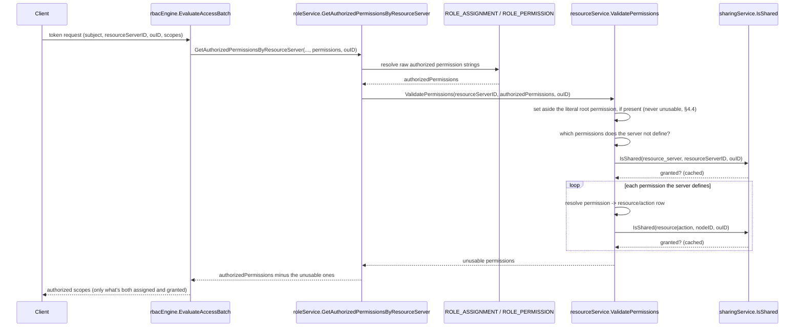

# Resource Server / Resource / Action Sharing — Design

This document designs a B2B sharing capability for the permission catalog itself: resource
servers, resources, and actions (`backend/internal/resource`), reusing the generic role-sharing
framework (`backend/internal/sharing`, see
[B2B_SHARING_ARCHITECTURE.md](B2B_SHARING_ARCHITECTURE.md)/[B2B_SHARING_DESIGN.md](B2B_SHARING_DESIGN.md))
rather than inventing a parallel mechanism. It is a design only — nothing described here is
implemented yet.

## 1. Problem Statement

Role sharing lets a role be shared across organization units (OUs), but a role's *permissions*
still name resource servers/resources/actions from a single, deployment-wide, unscoped catalog —
today, any resource server that exists is implicitly usable by any role in any OU, because
`internal/resource` has no OU-visibility concept at all (see §2). Two consequences the user wants
addressed:

1. **Feature availability per OU.** An OU should only be able to *use* a resource server,
   resource, or action — reference it in a role, and have that reference actually work — if it
   owns that node or it has been shared to it, down to individual-action granularity. The
   motivating example: a `Bookings` resource has `create` and `view` actions; if only `view` is
   shared to OU-B, a role in OU-B can be granted `view` but never `create`, regardless of what the
   role otherwise claims.
2. **Compound RBAC evaluation.** Resolving a shared role's permissions must check not just role
   sharing (already built) but *also* that the resource server, and the specific resource/action a
   permission string names, are visible to the acting OU. A permission recorded on
   `ROLE_ASSIGNMENT` is not sufficient by itself if the thing it names was never shared to that OU.

The design also asks: are any resource-server/resource/action fields naturally "editable" per
sharee OU, the way a role's `assignments` is? §3 answers this directly: no, with one documented
watch item.

## 2. Current State

Facts below are cited against the current working tree (branch `b2b-role-sharing-poc`).

**Data model** (`backend/pkg/thunderidengine/providers/model.go:193-204,181-190,170-178`):
`ResourceServer -> Resource (self-referential tree via Parent *string) -> Action (leaf)`. Every
level has its own DB-generated ID. `ResourceServer.OUID` exists (`model.go:199`), parallel to
`Role.OUID`. `Resource` and `Action` have **no OU column of their own**
(`dbscripts/configdb/postgres.sql:281-352`) — ownership is always inherited from their resource
server.

**OU_ID is decorative today.** `internal/resource/store_constants.go` has zero `WHERE OU_ID = ?`
clauses anywhere. `CreateResourceServer`/`UpdateResourceServer` only validate that the named OU
*exists* (`ouService.GetOrganizationUnit`) — there is no `requireOwnOUScope` equivalent anywhere in
`internal/resource`. No `apiPermissionEntries` pattern exists for `/resource-servers/**`
(`internal/system/security/permissions.go`), so every route there falls through to the root
`system` permission fallback (`getRequiredPermissionForAPI`, `security/service.go:160-168`) —
unlike Role, there is no `system:resource-servers`-style scope tier today. This design does not
introduce one; it adds OU-*visibility* only, layerable with a caller-scope tier later exactly the
way Role's was (out of scope here). That tier has since been added on top of this design, in the
shape §9 originally listed as future work; §4.5 documents it, and the state described in this
paragraph is what it replaced.

**Permission strings** are the delimiter-joined chain of ancestor resource `Handle`s plus the leaf
handle (`derivePermission`, `internal/resource/service.go:1524-1533`):
```go
func derivePermission(resourceServer providers.ResourceServer, parentResource *providers.Resource, handle string) string {
	if parentResource != nil {
		return parentResource.Permission + resourceServer.Delimiter + handle
	}
	return handle
}
```
The resource server's own `Identifier` is never part of the string. Both `RESOURCE.PERMISSION` and
`ACTION.PERMISSION` are stored, exact-match, indexed columns scoped by `RESOURCE_SERVER_ID`
(`queryValidatePermissions`, `internal/resource/store_constants.go:380-419`) — a role permission
string can name either a Resource node directly (a blanket permission covering its own subtree, via
`security.Covers`'s hierarchical prefix matching) or a leaf Action.

**RBAC evaluation never touches `internal/resource` today.** `rbacEngine.EvaluateAccessBatch`
(`internal/authz/engine/rbacengine.go:57-81`) calls
`roleService.GetAuthorizedPermissionsByResourceServer(ctx, entityID, groupIDs, resourceServerID,
permissions, ouID)` **once per (subject, resourceServerID, ouID) group**
(`groupEvaluations`, `rbacengine.go:82-101`), with a small, request-bounded `permissions` list —
this is the exact integration point for the new compound check (§4), and it is already
grouped/batched so the added work is bounded by the request's own scope list, never the whole
catalog.

**Existence-only validation exists today** at role write time:
`internal/role/service.go:829-874` (`validatePermissions`) calls
`resourceService.ValidatePermissions(ctx, resourceServerID, permissions)`
(`internal/resource/service.go:1251`), which only confirms each permission string exists somewhere
under that resource server — it has no OU-awareness.

**Declarative support** (`internal/resource/declarative_resource.go`) mirrors Role's: a
`Mutable | Declarative | Composite` store mode, with `IsResourceServerDeclarative` gating
mutation. Sharing a declarative resource server is not a mutation of its own row (it only creates
`RESOURCE_GRANT` rows in a separate table), so it needs no special-casing beyond what Role already
established — a declarative resource can still be shared, it just can't be edited.

**Wiring already in place**: `internal/role`'s `roleService` struct already holds both a
`sharingService` and a `resourceService` field — no new cross-package dependency is needed on the
`internal/role` side beyond one new method call.

## 3. Why No Templated Fields

Role's one templated field, `assignments`, is legitimate per-OU state layered on top of a shared,
unchanging role definition — each sharee OU reasonably wants its own membership list for the same
permission grant. ResourceServer/Resource/Action have no analogous field. Every field —
`Name`, `Description`, `Identifier`, `Type`, `Delimiter` (server); `Name`, `Handle`, `Description`,
`Parent` (resource); `Name`, `Handle`, `Description`, `Kind` (action) — defines the permission's
*global* identity or meaning. Letting a sharee OU override any of them would fragment what's
supposed to be one consistent permission across every OU that can see it: two OUs disagreeing on
what `system:roles:view` means, or on a resource's own handle (which is literally part of the
permission string), breaks the catalog's whole reason for being shared in the first place.

**Conclusion: this design declares zero templated fields for all three new resource types.**
`ResourceTypeDeclaration.TemplatedFields()` returning an empty slice needs no framework change —
confirmed against the interface itself (`internal/sharing/model.go:184-189`); nothing in
`internal/sharing` assumes a non-empty declaration.

**One watch item worth flagging explicitly**, per the request to point out anything that looks
editable: both `RESOURCE_SERVER.PROPERTIES` and `RESOURCE.PROPERTIES`
(`JSONB`, `dbscripts/configdb/postgres.sql:267,290`) exist in the schema but are **not currently
exposed anywhere in the Go API model** — `providers.ResourceServer` and `providers.Resource` have
no `Properties` field at all. If either is ever surfaced (e.g. MCP-connection-specific
configuration that a consuming OU might reasonably want to set independently of the shared
permission definition itself), it would be the first legitimate candidate for a real
templated/editable field on this resource type, structurally analogous to `assignments`. Today it
is unused, and this design does not touch it.

This also closes the loop on a separate question asked this session: `RESOURCE_OVERLAY` (the
generic per-(resource, OU, field) value store built alongside `RESOURCE_GRANT*` but never wired to any
caller) gets **no consumer from this feature either** — reinforcing that it remains unused
scaffolding until some future resource type actually has a scalar templated field.

## 4. Core Mechanism

### 4.1 Three new resource types, zero framework changes

A new `internal/resource/resource_type_declaration.go`, mirroring
`internal/role/resource_type_declaration.go` exactly, declares three independent sharing-framework
resource types — one per tree level, so sharing granularity matches the grain the user asked for
(share a resource but withhold one of its actions):

```go
const (
	resourceServerSharingType sharing.ResourceType = "resource_server"
	resourceNodeSharingType   sharing.ResourceType = "resource"
	actionSharingType         sharing.ResourceType = "action"
)
```

Each implements only `ResourceTypeDeclaration` — `ResourceType()` plus `TemplatedFields()`
returning an empty slice (§3). None implements `SharingHooks` (no per-OU mutable state to clean up
on unshare) or `DeletionOwnershipError` (no custom deletion-rejection message planned) — both are
optional, type-asserted capabilities (`internal/sharing/model.go:191-209`), so either could be
added later with no interface change.

**Ownership resolution**: every `Share()` call for a Resource or Action resolves `owningOUID` as
**its resource server's `OUID`** (looked up once via the existing `GetResourceServer`), never its
own — Resource/Action have no OU column, so this is the only coherent answer to "who owns this for
sharing purposes." This keeps root-vs-children-targeting and the cross-tree restriction
(`resource_sharing.allow_child_ou_cross_tree_sharing`) working identically to Role, with zero
changes to `internal/sharing` itself — the generic engine never needs to know a Resource's OU is
borrowed from its parent server.

### 4.2 `ValidatePermissions` — the existing method, now organization-unit aware

No new resolution method is introduced. `ResourceServiceInterface.ValidatePermissions` (and its
`providers.ResourceServerProvider` twin, which is how the OAuth layer reaches it) takes the acting
organization unit as a parameter:

```go
ValidatePermissions(
    ctx context.Context, resourceServerID string, permissions []string, ouID string,
) ([]string, *tidcommon.ServiceError)
```

It returns the permissions that are **not usable**, which is what the method already meant; the OU
simply adds a second reason for a permission to be unusable. An empty `ouID` validates against the
resource server alone, exactly as before, so every caller with no single acting organization unit
keeps its existing behaviour unchanged.

Folding the check in here rather than beside it is deliberate. "Does this permission exist" and "may
this organization unit use it" are the same question asked of the same catalog, and a caller that
asks only the first is a caller that has silently skipped an authorization check. One method means
that is not expressible: passing an OU is the only way to name one, and passing none is a visible,
greppable declaration that no OU applies. It also keeps all resource-tree-sharing knowledge in one
place — `internal/role` and the OAuth grant handlers never need to know about resource/action
internals.

Algorithm:

1. **Deployment root permission bypass.** When an `ouID` is given, the literal deployment root
   permission string (`security.GetSystemRootPermission()`, e.g. `"system"`) is never reported
   unusable, and is removed from the set evaluated by the remaining steps. **This is a required
   correction, not an optional refinement** — see §4.4 for why, and why it cannot be handled via a
   grant.
2. **Existence.** The resource server is loaded, and the store's own permission lookup reports
   which of the candidates the server does not define. A resource server that does not exist makes
   every candidate unusable. With no `ouID`, this result is the answer and the steps below are
   skipped entirely — the sharing service is never consulted.
3. **Owner short-circuit.** If `ouID` owns the resource server (`ResourceServer.OUID == ouID`), the
   existence result stands unchanged — an owner always sees everything under its own server,
   matching Role's owner-always-sees-own-resource rule.
4. **Server-level gate.** Else call `sharingService.IsShared(ctx, resourceServerSharingType,
   resourceServerID, ouID)`. If false, every candidate is unusable — nothing under an ungranted
   server is visible, full stop, and every per-permission check below is skipped.
5. **Per-permission node check.** Else, for each permission that survived step 2, resolve which
   Resource-or-Action row it names via a new query (`queryResolvePermissionNode`, an exact-match
   lookup against `RESOURCE.PERMISSION`/`ACTION.PERMISSION` scoped by `RESOURCE_SERVER_ID`,
   structurally identical to the existing `queryValidatePermissions` but returning the owning row's
   ID and kind instead of a validity flag), then call `sharingService.IsShared(ctx,
   resourceNodeSharingType | actionSharingType, nodeID, ouID)` for that row. The permission is
   unusable unless that row is granted.

This is a single exact-match `IsShared` call per permission string, point-cached by the existing
`visibilityCache` already inside `internal/sharing/service.go` — the same cache used by every other
`IsShared` caller today, no new cache infrastructure. Cascade (§5.1) and auto-inherit (§5.2) push
all fan-out cost to write time, so this stays a flat, request-bounded set of cheap lookups — never a
resource-tree ancestor walk at read time, matching this framework's established RBAC-hot-path
philosophy ("never a per-grant traversal").



### 4.3 Two call sites

- **`internal/role/service.go:612` (`GetAuthorizedPermissionsByResourceServer`)** — after resolving
  `authorizedPermissions` from the store and before returning, drop whatever
  `rs.resourceService.ValidatePermissions(ctx, resourceServerID, authorizedPermissions, ouID)`
  reports unusable.
  This is the **mandatory** enforcement point per the user's explicit ask: it is the actual
  authorization decision, evaluated fresh on every request, so a resource/action unshared *after* a
  role was created stops being usable immediately, with no stale-permission window.
- **Write-time defense in depth (`CreateRole`/`UpdateRoleWithPermissions`)**. The existing
  `validatePermissions(ctx, permissions)` (`service.go:829-874`) is existence-only and is called
  from two places whose OU context differs:
  - `CreateRole` (`service.go:327`): `role.OUID` is already confirmed owned by the caller at this
    point (`requireOwnOUScope`, `service.go:305`), so a new check can be added immediately after
    the existing `validatePermissions` call at line 327-329, using `role.OUID`.
  - `UpdateRoleWithPermissions` (`service.go:470`): at that line, `existingRole` has **not yet been
    fetched** (`GetRole` happens later, at `service.go:481`) — the new check cannot run here. It
    must instead be added after both `RequireOwnership` calls complete (`service.go:501-509`),
    where `role.OUID` is confirmed owned/authorized, using `role.OUID` at that point.

  Both sites add an organization-unit-scoped `ValidatePermissions` call per resource-server group,
  rejecting the write (new error, analogous shape to `ErrorInvalidPermissions`) if it reports any
  requested permission unusable for that role's owning OU. Existence has already been established by
  the existing call, so anything it reports is a visibility failure. This catches a misconfiguration
  at grant time rather than only discovering the gap the next time a token is issued.

### 4.4 The deployment root permission is a bypass, not a grant

This needed real scrutiny, not just a passing mention: the bare deployment root permission (e.g.
`"system"`, `security.GetSystemRootPermission()`) is **already** a real resource-server permission
today, not merely a magic string — it is set to `buildPermission(handle, "system")`
(`internal/system/security/permissions.go:178`), the exact same string `derivePermission` computes
for the bootstrap "System" resource server's own top-level resource (handle `"system"`,
`cmd/server/bootstrap/01-default-resources.yaml:91-98`). And it is granted to callers, including the
very first bootstrap admin, through an ordinary role assignment resolved by the same
`GetAuthorizedPermissionsByResourceServer` call this design modifies (RBAC evaluation has no
separate bootstrap bypass path — confirmed in §2). Without an explicit accommodation,
the organization unit check would silently strip `"system"` out of any role's authorized permissions
for every OU other than whichever one owns the System resource server (`default`, per the bootstrap
YAML), breaking root/admin access on upgrade for any multi-OU deployment.

**Why a grant (`AllRoots` + per-root reshare, as one might first assume) does not fix this
for the bare root permission**, verified against the actual visibility algorithm
(`internal/sharing/service.go:996-1043`):
- `TargetScopeAllRoots` coverage of `chain[0]` (an OU's own tree root) is evaluated fresh against
  the live OU hierarchy at every check (`service.go:1001-1013`) — a root OU created *after* the
  grant automatically satisfies it. This part *is* dynamic, and would work.
- Coverage of any **non-root** OU (`i > 0` in the chain) requires a *second*, independent grant: an
  `AllChildren` reshare anchored at some already-covered ancestor (`service.go:1026-1043`). That
  reshare is issued by, and is the sole prerogative of, whichever root owns that subtree — a root
  created after bootstrap has to perform its own one-time reshare before its descendants gain
  visibility. There is no single grant meaning "every root and every one of their descendants,
  including trees that don't exist yet."
- This is not a limitation to route around — it is this framework's core federated-trust design
  (a deployment owner cannot unilaterally reach into a tenant's subtree; §4 of
  [B2B_SHARING_ARCHITECTURE.md](B2B_SHARING_ARCHITECTURE.md)). Forcing the *literal* root permission
  through it would make "root access" conditional on every tenant's own opt-in reshare, which
  inverts what root is supposed to mean.

**The fix**: treat the deployment root permission as a categorical exemption from the organization
unit check, exactly mirroring how it already bypasses every other OU-boundary check
in this codebase (`requireOwnOUScope`, `sharing.RequireOwnership`/`RequireOwnershipForDeletion`, the
cross-tree restriction) — root means "no OU boundaries apply," a concept that predates and is
orthogonal to the sharing framework, not a maximally-shared permission. This is step 1 of §4.2's
algorithm above, and it is a required part of this design, not an optional refinement — omitting it
is a genuine regression, not a missing nice-to-have.

**What the declarative `AllRoots` + reshare pattern *is* the right tool for**: any *other*,
narrower System-resource-server permission that should be broadly available without being
literally boundary-less — most concretely `system:roles`/`system:roles:view` themselves. For those,
a bootstrap-time declarative share (share the "Roles" resource, or the whole System resource server,
with `allRoots: true`) is exactly the mechanism this design already provides, with the caveat above
stated plainly rather than glossed over: it makes the permission visible to every current and future
root OU immediately, and to each root's own subtree only once that root issues its own `AllChildren`
reshare (a deliberate, one-time admin action per tenant, not automatic). Whether to make that
reshare itself part of a root OU's own creation bootstrap (i.e. auto-reshare newly created root OUs
into visibility of a designated set of "deployment-standard" permissions) is a reasonable follow-up
question but is **OU lifecycle orchestration, not a resource-sharing framework concern** — it would
belong in `internal/ou`'s own OU-creation flow, not here, and is out of scope for this design.

### 4.5 The caller-scope tier: `system:resource-servers` and own-OU confinement

§2 recorded that every `/resource-servers/**` route fell through to the root `system` permission
fallback, and that this design adds OU-*visibility* only, layerable with a caller-scope tier later
"exactly the way Role's was". That tier now exists and is enforced alongside this design's
visibility layer, so the two are documented together here: **the scope decides what class of
operation a caller may attempt, and the OU tier decides which organization unit's entities it may
attempt it on.** Both tiers are subordinate to the same two bypasses used everywhere else in this
codebase: `security.IsRuntimeContext(ctx)` (bootstrap, flow executors) and
`security.HasSystemPermission` (a caller holding the deployment's root permission), which remain
completely unrestricted.

**Tier 1: the scope.** `internal/system/security/permissions.go` gains
`SystemPermissions.ResourceServers`/`.ResourceServersView`, built by `InitSystemPermissions` as
`system:resource-servers` and `system:resource-servers:view` (handle-prefixed through the same
`buildPermission` helper as every other entry), plus six `apiPermissionEntries` rows that mirror
Role's own six exactly:

```go
{"GET /resource-servers", p.ResourceServersView},
{"POST /resource-servers", p.ResourceServers},
{"GET /resource-servers/**", p.ResourceServersView},
{"PUT /resource-servers/**", p.ResourceServers},
{"POST /resource-servers/**", p.ResourceServers},
{"DELETE /resource-servers/**", p.ResourceServers},
```

No further wiring is needed, because `HasSufficientPermission`'s hierarchical prefix match already
makes `system` satisfy both new permissions and `system:resource-servers` satisfy
`system:resource-servers:view`. Read routes therefore need only the view scope; every mutation
route, share-grant `POST`/`DELETE` included, needs the manage scope.

**Tier 2: OU confinement, on top of the scope.** Neither new scope carries a subtree tier, so a
caller holding either one without the root permission is confined to the single organization unit
its token was issued for (`security.GetOUID(ctx)`). Which primitive enforces that depends on what
the operation does to core config, not on its HTTP verb:

| Method (`internal/resource`) | Check | Rejects with | Why this primitive |
|---|---|---|---|
| `CreateResourceServer` (`service.go:317`) | `requireOwnOUScope(ctx, resourceServer.OUID)` | `RES-1024` | The request names its own target OU and no entity exists yet, so there is nothing for the sharing framework's ownership framing to apply to. This is the same shape as Role's `CreateRole`/`ROL-1023`. |
| `CreateResource` (`:673`), `CreateAction` (`:1038`) | `requireOwnOUScope(ctx, resourceServer.OUID)` | `RES-1024` | Resource/Action have no OU of their own (§2), so the parent server's `OUID` is the target OU. Deliberately *not* `RequireVisibility`: **create is owner-only**, so a sharee OU may not add resources or actions to a resource server merely shared to it. A new node inherits the parent's grants automatically (§5.2), which would otherwise let a sharee inject core config into every other sharee's view of a catalog it does not own. |
| `GetResourceServer`, checked in `HandleResourceServerGetRequest` (`handler.go:98`) | `RequireVisibility(resourceServerSharingType, id, result.OUID)` | `RES-1024` | Own OU or share-visible. See the next subsection for why the check sits in the handler. |
| `GetResource` (`:793`), `GetAction` (`:1174`) | `RequireVisibility(resourceNodeSharingType \| actionSharingType, id, resourceServer.OUID)` | `RES-1024` | Same rule, applied inline in the service method, since neither has external reuse. |
| All nine share-grant methods (`sharing.go:396-554`: `Share`/`ListGrants`/`Unshare...Grant`, once per tree level) | `RequireVisibility(...)` | `RES-1024` | A reshare by a sharee is the same call, and the same visibility rule, as the owner's own first share (§5.1); resolving the node through `RequireVisibility` is what makes that true without a second code path. Listing and revoking grants use the identical gate, so a sharee can inspect and undo what it itself redistributed. |
| `UpdateResourceServer` (`:527-538`) | `sharingService.RequireOwnership(resourceServerSharingType, existingResServer.OUID)`, plus a second `RequireOwnership` on `resourceServer.OUID` when the request moves the server to a different OU | `SHR-1007` | Core (non-templated) config, of an entity that already exists: exactly the invariant `RequireOwnership` states. Share-visibility must never confer this, so `RequireVisibility` would be wrong here. The second call closes the move loophole: a caller cannot push a server it owns into an OU it does not. |
| `UpdateResource` (`:914`), `UpdateAction` (`:1279`) | `sharingService.RequireOwnership(<node type>, resourceServer.OUID)` | `SHR-1007` | Same reasoning, against the owning resource server's OU. |
| `DeleteResourceServer` (`:628`), `DeleteResource` (`:988`), `DeleteAction` (`:1376`) | `sharingService.RequireOwnershipForDeletion(<type>, <owning OUID>)` | `SHR-1007` | Identical ownership and bypass rules, on the deletion path. None of the three declarations implements the optional `DeletionOwnershipError` (§4.1), so all three surface the generic `ErrorCoreConfigOwnerOnly` rather than a resource-specific message, unlike Role's own `ROL-1024`. |

The two package-local primitives live in the new `internal/resource/authz.go`:
`requireOwnOUScope(ctx, targetOUID)` is the bypasses-then-`GetOUID(ctx) != targetOUID` check,
returning `ErrorResourceOutsideOwnOUScope` (`RES-1024`, `error_constants.go:289-306`), the
resource-package analogue of Role's `ErrorRoleOutsideOwnOUScope` (`ROL-1023`).
`(*resourceService).RequireVisibility` layers this design's own visibility concept on top: it calls
`requireOwnOUScope` first and, only if that rejects, falls back to
`sharingService.IsShared(ctx, resourceType, resourceID, security.GetOUID(ctx))`, returning the
`RES-1024` error when neither holds. So "owned" and "shared to me" are one predicate at every read
and share-grant site, and the caller never has to know which of the two granted access.

**Why `GetResourceServer`'s visibility check lives in the handler, not the service method.** Unlike
`GetResource`/`GetAction`, `GetResourceServer` has two non-admin internal consumers that must never
be OU-restricted: OAuth resource-indicator/audience resolution during token issuance, which reaches
it through `providers.ResourceServerProvider`, and the declarative exporter behind its own
root-gated endpoint. Putting `RequireVisibility` inside the service method would reject token
issuance for any OU requesting a token for a resource server it does not own, which is precisely
the case this design handles the *other* way, by issuing the token and filtering its permissions
through `ValidatePermissions` (§4.2). The check therefore sits in
`HandleResourceServerGetRequest`, immediately after the service call, and `RequireVisibility` is
exported on `ResourceServiceInterface` (`service.go:113-124`) so the handler layer can apply it.
`GetResource`/`GetAction` have no such reuse, so their checks stay inline in the service methods
where a future second handler cannot forget them. The asymmetry is intentional and is documented at
both sites.

**`GET /resource-servers` is OU-confined; the nested list endpoints are not.**
`HandleResourceServerListRequest` (`internal/resource/handler.go`) mirrors Role's own
`HandleRoleListRequest` (`internal/role/handler.go:58-63`): a caller that is neither a runtime
caller nor a holder of the root permission is rerouted to `GetResourceServersForOU(ctx,
security.GetOUID(ctx), limit, offset)` instead of the deployment-wide `GetResourceServerList`.
`GetResourceServersForOU` enforces `requireOwnOUScope` and then returns the owned-plus-shared
listing for that one OU, combining `resourceStore.GetResourceServerListByOUID` (a new
`WHERE OU_ID = ?` query, implemented across all three store modes) with
`sharingService.ListSharedResourceIDs`, and skipping any stale grant that still points at a
deleted resource server. `totalResults` reflects the filtered set, and pagination is applied to the
combined slice, since the owned and shared halves cannot be paginated independently without
skipping or duplicating rows across page boundaries. This is the same shape as
`ListRolesForOU` (`internal/role/service.go:133-`), minus the `origin` tagging, which Role needs
because its list response carries it and the resource server list response does not.

**Still open: the nested list endpoints apply the scope tier but no OU filter.**
`GetResourceList`, `GetAllResourceList`, and `GetActionList` contain no OU predicate, and their
handlers add none, so a caller that can see a resource server at all can enumerate every resource
and action beneath it. Two qualifications bound this:

- A caller only reaches these paths for a resource server it owns or one shared to it, because the
  path's own `{rsId}` has to resolve and the single-entity reads that gate the interesting cases
  are confined (§4.2). The exposure is therefore within an already-visible resource server, not
  across the deployment.
- What is exposed is **catalog metadata only** (names, handles, descriptions, and the derived
  permission strings), never the ability to use any of it: whether a role in some OU may actually
  be granted a permission is decided independently by §4.2's compound check and §4.3's write-time
  validation, neither of which consults these listings. That bounds the severity; it does not make
  the behavior correct.

Closing it needs the per-tree-level equivalent of what `GetResourceServersForOU` now does for the
top level. Tracked in §9.

### 4.6 The System resource server must be visible to every OU: `TargetScopeAllOUs`

§4.5's scope tier creates a bootstrapping problem it cannot solve on its own. The permissions that
gate the management APIs (`system:resource-servers`, `system:roles`, and the rest) are *resources of
the System resource server*, which the bootstrap owns under the default OU
(`backend/cmd/server/bootstrap/01-default-resources.yaml`). So a role in any *other* OU naming one
of them is caught twice by this design's own checks:

1. **Write time** (§4.3): `checkPermissionVisibility` runs an OU-scoped `ValidatePermissions`, whose
   server-level gate (§4.2 step 4) makes nothing under a resource server visible to an OU that
   neither owns it nor has it shared. The role write is rejected with `ROL-1025`.
2. **Token issuance** (§4.2): even if the role existed, the same gate drops the permission, so the
   token comes back without it.

There is a second, independent trap for anyone working around (1) by putting the role in the
default OU instead: role permissions resolve through `ROLE_ASSIGNMENT.ASSIGNING_OU_ID`, and an
assignment made on a default-OU-owned role is recorded against the default OU. A token whose `ouId`
claim is some other OU then matches no assignment at all, so it is issued with no scopes. Both
blockers have to be removed, and sharing the resource server removes both at once: the role can
then simply live in the OU its applications live in.

**Why no existing scope expresses this.** Verified against `evaluateChainVisibility`
(`internal/sharing/service.go`): `TargetScopeAllRoots` is only ever consulted at chain position 0,
so it covers Root OUs and nothing beneath them. Covering their subtrees needs one
`TargetScopeAllChildren` reshare per Root, and `Share()` rejects combining a root-targeting and a
children-targeting field in one call. Worse, nothing can pre-issue a subtree reshare for a Root
created *later*, so "all roots and their children" degrades silently the moment a new tenant tree
appears: the new Root would see the System resource server, its children would not, and every role
they own naming a system permission would start failing.

**The primitive.** `TargetScopeAllOUs` / `SharePolicy.AllOUs` is one share-stage grant covering
every OU at every depth, current and future, minus its own `ExcludedOUIDs` (and their subtrees).
It is deliberately narrow in every other respect:

- **Owner-only**, enforced in `Share()` alongside the root-targeting check. A sharee resharing what
  it received can still only fan out within its own subtree, so this is not an escalation path.
- **A fallback, never a shadow.** In `evaluateChainVisibility` it is evaluated per chain position
  only *after* every specific grant has been tried, so a narrower grant covering the same OU stays
  the recorded `nearestGrant`, which editability resolution treats as authoritative.
- **Share-stage only.** A reshare-stage `all_ous` row is ignored outright, so a forged or migrated
  row cannot confer deployment-wide visibility.
- **Exclusions cut off subtrees**, matching how an excluded Root's subtree is cut off by being
  unreachable through position 0: the whole ancestry down to the OU under test is checked, not just
  the OU itself.
- **No cross-tree restriction applies.** `resource_sharing.allow_child_ou_cross_tree_sharing` gates
  a *non-root owner* reaching outside its own tree; an `all_ous` grant spans every tree by
  construction, so gating it on the owner's own tree would be meaningless.

Three places outside the evaluator needed it too, each a real failure mode if missed: the store's
`buildRelevantGrantsQuery` pre-filter (an `all_ous` grant matches no `TARGET_OU_ID` in any chain, so
without adding it to the scope allow-list the evaluator would simply never see the row); the
`TARGET_SCOPE` `CHECK` constraint in both DDL files (which would otherwise reject the insert); and
`policyFromGrant`, so `ExportGrants` round-trips it for export/import and for the auto-inherit
replay of §5.2.

**How the grant gets created.** `resource_server` documents now accept the same `grants:` block
role documents already did, replayed by `importService.applyResourceServerSharing`. The bootstrap
document declares `grants: [{allOus: true}]`, and that one line covers the whole System
permission tree, because `ShareResourceServer`'s cascade (§5.1) reaches the server's own resources
and actions and anything added later auto-inherits (§5.2).

**The replay must go through `resourceService.ShareResourceServer`, not `sharingService.Share`.**
This is the one non-obvious part, and getting it wrong fails in a way that looks like the grant
worked. Role's path calls the generic `sharingService.Share` directly, which is correct for a role:
a role *is* the shared thing. A resource server is not — it has no permission string of its own,
its permissions are its resources and actions. A grant on the server row alone satisfies §4.2's
step-3 server gate but fails the step-4 per-permission node check, so every permission the server
defines stays invisible and every role naming one is still rejected with `ROL-1025`, even though
`GET /resource-servers/{id}/grants` shows a healthy `all_ous` grant. The cascade is what puts
grants on the resource and action rows the check actually consults.

This was a real bug in the first cut of this section, and it survived a passing integration test:
the test asserted on the System resource server's top-level `system` resource, whose derived
permission is literally the deployment root permission string and is therefore kept unconditionally
by §4.4's bypass, with no grant consulted at all. The regression test now hangs a *sub-resource*
off `system` and asserts on its ordinary permission string, which exercises the sharing path for
real. Reverting the cascade reproduces `ROL-1025`; that was verified, not assumed.

Unlike `applyRoleSharing`, this replay is **idempotent**. Bootstrap is upsert-based and re-runs
against an existing deployment, and `Share()` does not dedupe (there is no uniqueness constraint on
`RESOURCE_GRANT`), so an unconditional replay would append a duplicate grant row on every run.
`applyResourceServerSharing` therefore compares each declared grant against `ExportGrants`' current
replayable set and skips the ones already present. Duplicate grants are harmless to evaluation,
which is a disjunction, but they accumulate without bound and show up in `ListGrants`. Role's
own path still has this bug; it is called out in §9.

## 5. Cascade Share/Unshare and Auto-Inherit

Bulk fan-out lives entirely in `internal/resource`'s own orchestration layer, built from repeated
calls to the unmodified generic `Share`/`Unshare`/`ListGrants`/`ExportGrants` — no new
sharing-framework primitive.

### 5.1 Cascade share, with exclusions

Sharing a ResourceServer or a non-leaf Resource bulk-creates individual grants for it *and*
every node currently beneath it. The `POST .../grants` request body reuses `role.ShareRequest`'s
exact shape (`allRoots`/`rootOuIds`/`allChildren`/`ouIds`/`excludedRootOuIds`/`excludedOuIds`) plus
one new field valid only on the non-leaf variants: `excludedNodeIds []string` — specific descendant
resource/action IDs to leave out of the cascade. This is a resource-package-local request field
(mirrors `SharePolicy.ExcludedOUIDs` in spirit — "share broadly, name exceptions"), not a change to
`sharing.SharePolicy` itself, which stays purely OU-targeting.

**`ShareResourceTree` algorithm** (new private helper reused by all three levels' `POST` handlers):
1. Resolve `owningOUID` (the resource server's `OUID`).
2. Call `sharingService.Share` for the node itself with the given OU-targeting policy.
3. Recursively enumerate every descendant resource/action, reusing the existing parent-filtered
   `GetResourceList`/`GetActionList` listing calls as-is (no new store queries needed).
4. For each descendant not in `excludedNodeIds`, call `sharingService.Share` with the identical
   OU-targeting policy.
5. Return every grant created across the whole call — the response's `grants` array reflects the
   full cascade, not just the top node, so the caller can see (and later individually revoke) what
   was actually created.

**Worked example** (the user's own scenario): `Bookings` resource has actions `view` and `create`.
`POST /resource-servers/{rsId}/resources/{bookingsId}/grants` with
`{"rootOuIds": ["ou-B"], "excludedNodeIds": ["<create-action-id>"]}` creates:
- one `resource` grant for `Bookings` itself (`TargetScope: root`, `TargetOUID: ou-B`)
- one `action` grant for `view` (same target)
- **no** grant for `create`

OU-B can now be granted the `view` permission on a role (it passes the per-permission node check of
`ValidatePermissions` for the `view` Action row); granting `create` is rejected at write time
(§4.3) and, even if it somehow ended up on a role another way, filtered out at every RBAC
evaluation (§4.2 step 5).

### 5.2 Auto-inherit on creation

`CreateResource`/`CreateAction` (`internal/resource/service.go:558`, `:890`) check, after the new
row is created, whether their parent (or the resource server, for a top-level resource/action) has
active grants, and if so, replay each one for the new child. This reuses `ExportGrants`
(`internal/sharing/service.go:547`, built earlier this session for export/import round-tripping)
verbatim — it already returns each grant as a replayable `(ActingOUID, SharePolicy)` pair:

```go
grants, svcErr := sharingService.ExportGrants(ctx, parentType, parentID)
for _, g := range grants {
    sharingService.Share(ctx, childType, newChildID, owningOUID, g.ActingOUID, g.Policy)
}
```
where `parentType`/`parentID` is the resource server when creating a top-level resource/action, or
the parent Resource otherwise. This is the second time this session `ExportGrants` has turned out to
be exactly the right primitive for a "reproduce this resource's sharing state elsewhere" need it
wasn't originally built for (the first was `POST /import`) — a good sign the generic framework's
surface is shaped correctly, not just built to the first use case.

**Known limitation, by design**: a newly created action does not retroactively become visible to an
OU that was in the `excludedNodeIds` list of an ancestor's cascade share — auto-inherit only
replays what the parent's *current* grants say, so an intentional exclusion at the parent level is
never silently bypassed by adding a new sibling.

### 5.3 Cascade unshare

Given the grant ID being revoked, read it (the same `GetGrant`-shaped lookup Role's own unshare
handler already uses) to recover its `TargetScope`/`TargetOUID`/`ActingOUID`. Re-walk the identical
descendant enumeration used at share time (§5.1 step 3); for each descendant, call
`sharingService.ListGrants` and revoke any grant matching the **same** `TargetScope` +
`TargetOUID` (or `ActingOUID`, for a reshare-stage grant) as the one being revoked.

This recomputes cascade membership by symmetry with the share algorithm rather than persisting a
"cascade group" concept in the schema — no new table or column, `ListGrants` is already
generic. It is the one piece of real algorithmic subtlety in this design, so to be precise: two
grants are considered part of the same cascade operation, and therefore revoked together, if and
only if they target the exact same OU-selection (same `TargetScope`, same `TargetOUID`/root-set,
same `ExcludedOUIDs`) — a grant created by a *different* share call (even one that happens to name
the same OU) is left untouched, since it represents a separate administrative decision that this
revoke was never asked to undo.

### 5.4 Role permission cleanup on unshare

Read-time enforcement (§4.2/§4.3) is not, on its own, enough: a role that named a permission while
it was still shared keeps that permission in its own stored `ROLE_PERMISSION` rows forever, even
after the underlying resource/action is unshared — filtered out at every evaluation, but never
actually removed from the role's own definition. This leaves a role's displayed/exported permission
list silently claiming access it can no longer use, and (per §4.3's second bullet) able to "regain"
that access with zero write-time check the moment the OU re-shares the same permission, since
nothing about the role's own row ever changed. Unsharing a resource or action therefore also strips
the affected permission from every role that named it, owned by the OU that just lost access.

**Mechanism: `sharing.SharingHooks.OnUnshare`, already built for exactly this.** The generic
framework's `Unshare` (`internal/sharing/service.go`) already calls `OnUnshare(ctx, resourceID,
ouID)` once per OU that loses access to a revoked grant — Role's own resource type declaration
already implements it, to delete a sharee's `ROLE_ASSIGNMENT` rows when a role stops being visible
to that OU. `resourceNodeTypeDeclaration` and `actionTypeDeclaration` (§4.1) now implement it too;
`resourceServerTypeDeclaration` does not, since a resource server has no permission string of its
own (`derivePermission` never includes the resource server's `Identifier`) and cascade unshare
(§5.3) always revokes every descendant's own grant individually, so each descendant's own
`OnUnshare` fires for itself — there is nothing left at the resource-server level to clean up.

**Resolving a bare node ID back to a permission string.** `OnUnshare`'s signature carries only the
node's own ID, not its resource server, so a new inverse lookup,
`resourceStoreInterface.ResolveNodePermission(ctx, kind, nodeID) (resourceServerID, permission
string, found bool, err error)`, resolves both in one call — implemented across all three store
modes (DB, file-based/declarative, composite), mirroring `ResolvePermissionNode`'s existing
resource-server-scoped exact-match lookup (§4.2) but keyed the other direction.

**Crossing into `internal/role` without a cyclic import.** `internal/role` already imports
`internal/resource` (for `ValidatePermissions`), so `internal/resource`
cannot import `internal/role` back. A new narrow interface, `resource.RolePermissionRevoker`
(`RevokeRolePermissionForOU(ctx, ouID, resourceServerID, permission string) (int, error)`), is
defined in `internal/resource` and implemented by `roleService`; `resourceService` gains an
optional `rolePermissionRevoker` field and a `SetRolePermissionRevoker` setter, wired by
`servicemanager.go` after both packages are initialized — the identical two-phase-init shape
already used for `SetDependencyRegistry` (`internal/system/resourcedependency`). `onNodeUnshared`
(the shared implementation both declarations' `OnUnshare` delegate to) is a documented no-op if the
revoker was never wired in, so every existing test/caller that never sets it keeps working
unchanged.

**The store-level deletion query is a plain OU-scoped `DELETE`, not a new column.** `ROLE_PERMISSION`
has no OU column of its own; a new query,
`DELETE FROM "ROLE_PERMISSION" WHERE RESOURCE_SERVER_ID = ? AND PERMISSION = ? AND DEPLOYMENT_ID = ?
AND ROLE_ID IN (SELECT ID FROM "ROLE" WHERE OU_ID = ? AND DEPLOYMENT_ID = ?)`, joins through the
already-indexed `ROLE.OU_ID` instead (see "Alternatives Considered" below for why this is preferred
over denormalizing an OU column onto `ROLE_PERMISSION` itself). This leaves roles owned by *other*
OUs (which may hold their own, independent visibility of the same permission) untouched — mirroring
the existing, deployment-wide `DeleteRolePermission` used by resource-deletion cleanup
(`CascadeDeleteDependencies`), scoped down to one OU.

**Cache invalidation.** `internal/role`'s point-lookup cache (`cacheBackedRoleStore`, wrapping
`GetRole` by ID) must be invalidated by both this new OU-scoped deletion and the pre-existing
deployment-wide one, or a role fetched immediately after either would still show the just-deleted
permission. `DeleteRolePermissionForOU` invalidates every role owned by the target OU specifically
(cheap: one OU's role count, not the whole deployment); `DeleteRolePermission` — deployment-wide by
construction, since its caller already re-validates every referenced permission across the entire
deployment — clears the whole cache instead, trading a temporary cold cache for avoiding an
unbounded enumeration. Both are admin/write-path operations (an unshare or a resource/action
deletion), never the request-time RBAC hot path.

**Removal is durable: resharing does not resurrect a stripped permission.** This is the most
consequential behavioral implication of §5.4, and the one easiest to get wrong when reasoning about
the feature. Because the permission is physically deleted from `ROLE_PERMISSION` rather than
filtered, re-sharing the same resource/action later restores the OU's *visibility* of it but leaves
every affected role still not naming it. A token minted after the reshare therefore still lacks the
permission until the role's owner explicitly re-adds it (`PUT /roles/{id}`), at which point §4.3's
write-time check re-validates visibility and allows it precisely because the node is visible again
(the identical update is rejected with `ROL-1025` while it is unshared).

That asymmetry is deliberate. Granting a permission to a role is an administrative decision by the
role's owning OU; a grant issued by a *different* OU should never silently re-confer it. The
alternative, remembering stripped permissions so they reappear on reshare, would mean an
administrator in the owning OU could reinstate access inside a sharee OU's roles without anyone in
that OU acting, which inverts who decides what a role grants. Verified end to end by
`tests/integration/resource/resource_sharing_authz_test.go`'s
`TestReshareDoesNotResurrectStrippedPermission`, and demonstrated in the Postman collection's
folder `02`.

**Cascade unshare strips every descendant's permission, not just the named node's.** Revoking a
resource-server-level or non-leaf-resource grant revokes each descendant's own grant individually
(§5.3), and each of those revocations fires this same hook for itself, so a role naming several
permissions under one resource server loses all of them from a single top-level revoke. Verified by
`TestCascadeUnshareStripsEveryDescendantPermission`.

## 6. HTTP Surface

Mirrors Role's `/roles/{id}/grants` sub-resource pattern, once per tree level:

| Method | Path |
|---|---|
| `POST`/`GET` | `/resource-servers/{id}/grants` |
| `DELETE` | `/resource-servers/{id}/grants/{grantId}` |
| `POST`/`GET` | `/resource-servers/{rsId}/resources/{id}/grants` |
| `DELETE` | `/resource-servers/{rsId}/resources/{id}/grants/{grantId}` |
| `POST`/`GET` | `/resource-servers/{rsId}/actions/{id}/grants` (server-level actions) |
| `POST`/`GET` | `/resource-servers/{rsId}/resources/{resourceId}/actions/{id}/grants` |
| `DELETE` | `.../actions/{id}/grants/{grantId}` (both action route shapes) |

`GET` on any of these lists only that node's own grants (not the cascade's descendant grants —
those are visible via the descendant's own `GET .../grants`), matching how Role's
`GET /roles/{id}/grants` is scoped to one resource today.

## 7. Reuse Ledger

**Reused unchanged**: `Share`/`Unshare`/`IsShared`/`ListGrants`/`ExportGrants`, root-vs-
children-targeting, the cross-tree restriction and its `resource_sharing.allow_child_ou_cross_tree_sharing`
setting, exclusion lists, the point-invalidated visibility cache, and the entire `RESOURCE_GRANT`/
`RESOURCE_GRANT_EXCLUSION` schema — zero rows added to any table, zero columns changed, zero methods
added to `sharing.ServiceInterface`.

**New**: three `ResourceTypeDeclaration`s (the expected, designed-for extension point — exactly how
Role itself onboarded), the organization unit half of `ValidatePermissions`
(resource-package-local resolution logic, not a sharing-framework method), and two orchestration algorithms (`ShareResourceTree`/`UnshareResourceTree`
cascade, auto-inherit-on-create) that are specific to *tree-shaped* resources. A future resource
type that isn't tree-shaped (a flat catalog, like Role) would only need the first part — one
`ResourceTypeDeclaration` and whatever its own permission-resolution path looks like — confirming
the cascade/auto-inherit machinery is additive orchestration, not something baked into the sharing
framework that every future resource type would be forced to carry.

## 8. Alternatives Considered

| Alternative | Why rejected |
|---|---|
| A single `resource_server` sharing type with an included-permissions list on `SharePolicy` | Would require changing the generic, OU-targeting-only `SharePolicy` shape to carry a resource-tree concept that's orthogonal to OU targeting — every other resource type onboarded onto sharing would inherit a field meaningless to it. |
| Read-time ancestor-chain walking instead of write-time cascade | Cheap per individual call, but reintroduces per-request tree traversal at the RBAC hot path — exactly the cost class this framework has otherwise avoided everywhere (chain-walking exists only for the OU-hierarchy dimension, which the engine already amortizes via a single indexed fetch per chain, not per resource node). |
| Modeling included-actions via `EditableFields`/templated fields | Conflates write-access-to-per-OU-state (what `EditableFields` governs) with existence-visibility (what this feature needs) — a different semantic axis; also contradicted by §3's finding that no field here is legitimately per-OU state at all. |
| Persisting a "cascade group ID" on `RESOURCE_GRANT` to make unshare trivial | Would add a resource-server-specific column to the generic table every other resource type also uses, for a relationship (`§5.3`) fully recomputable at unshare time from data already there — an unnecessary schema change for the sake of light unshare-time convenience. |
| Modeling the deployment root permission's universal reach as a declarative `AllRoots` + per-root `AllChildren` share, instead of a hardcoded bypass (§4.4) | Verified against the actual visibility algorithm: `AllRoots` alone only covers root OUs, not their descendants, and reaching descendants requires each root's own independent reshare — there is no single grant meaning "every OU, including trees created later." Root is meant to mean "no OU boundary applies, unconditionally," which this two-hop, opt-in-per-tenant model cannot express. |
| Denormalizing the assignment-time OU onto `ROLE_PERMISSION` itself (a new `OU_ID` column), instead of joining through `ROLE.OU_ID` for the §5.4 cleanup query | A `ROLE_PERMISSION` row's OU is always exactly its owning role's OU — there is no scenario where the two legitimately diverge, so a copy carries no information the join doesn't already have. It would also need active upkeep: `UpdateRoleWithPermissions` already lets a role move to a different OU (`role.OUID != existingRole.OUID`), which would silently desynchronize a denormalized copy on every such move unless every write path remembered to update it too. The join is not a hot-path concern either — §5.4's cleanup runs at unshare time, an admin operation. |

## 9. Open Items / Future Work

- **Fixed during verification of this design**: no production caller previously reached
  `GetAuthorizedPermissionsByResourceServer` with a non-empty `ouID`, so §4.2/§4.3's "mandatory
  enforcement point" was never actually reachable from a real request.
  `providers.AccessEvaluationRequest` (`pkg/thunderidengine/providers/model.go`) had no OU field at
  all, and `toEngineAccessEvaluationsRequest` (`internal/authz/service.go`) — the sole adapter from
  that provider-facing type to the `engine.AccessEvaluationRequest` the RBAC engine groups by
  (which already carried an `OUID` field, per `internal/authz/engine/engine.go`, unused until now)
  — never populated it. This was a pre-existing gap in the already-committed role-sharing
  foundation this design builds on, not something introduced by the resource-sharing work itself,
  and it equally blocked role sharing's own OU-scoped enforcement. Fixed by adding
  `AccessEvaluationRequest.OUID string` (`json:"ouId,omitempty"`), threading it through
  `toEngineAccessEvaluationsRequest`, and populating it in the shared
  `buildAccessEvaluationsRequest` helper used by both `client_credentials.go` (from
  `oauthApp.OUID`) and `refresh_token.go` (from `subjectEntity.OUID`). Verified end to end via
  `tests/integration/resource/resource_sharing_authz_test.go`'s
  `TestCompoundRBAC_UnsharedActionPermissionDroppedAtTokenIssuance`, now passing against a real
  client_credentials token. **Still open**: the interactive flow executor
  (`internal/flow/executor/authz_executor.go`, its own separate, unshared
  `buildAccessEvaluationsRequest` method, used by the authorization_code/login flow for real human
  users) and AuthZEN (`internal/authzen/service.go`'s `toAuthzAccessEvaluationRequest`, which has
  no OU concept anywhere in its wire-level model) still never supply an OU, so OU-scoped
  enforcement remains unreached from those two entry points.
- **Fixed during verification of this design**: the `system:resource-servers`-style permission
  scope this item originally listed as future work, parallel to Role's
  `system:roles`/`system:roles:view`, now exists. `system:resource-servers` (manage) and
  `system:resource-servers:view` (read) replace the root `system` fallback on every
  `/resource-servers/**` route, and per-caller OU confinement is enforced on top of the scope, so
  resource-server management is genuinely OU-restricted rather than root-only. §4.5 documents both
  tiers in full: which primitive gates which method (`requireOwnOUScope` for create,
  `RequireVisibility` for single-entity reads and every share-grant operation,
  `sharing.RequireOwnership`/`RequireOwnershipForDeletion` for core-config update/delete), the
  `RES-1024` and `SHR-1007` rejections, and why `GetResourceServer`'s check sits in the handler
  rather than the service method. `GET /resource-servers` is confined too: a non-root caller is
  rerouted to `GetResourceServersForOU`, its own OU's owned-plus-shared listing, mirroring Role's
  `GET /roles` (new `GetResourceServerListByOUID`/`GetResourceServerListCountByOUID` store methods
  back it across all three store modes). **Still open**: the *nested* list endpoints
  (`GET /resource-servers/{id}/resources`, `GET .../actions`) apply the scope tier but no OU
  filter, so a caller that can see a resource server can enumerate everything beneath it. Closing
  it needs the per-tree-level equivalent of `GetResourceServersForOU`; see §4.5's note for why what
  is exposed today is catalog metadata only, never usable permissions.
- **Role's declarative share-grant replay is not idempotent.** `applyRoleSharing`
  (`internal/system/importer/service_adapters.go`) and `internal/role`'s own
  `applyPendingShares` both call `sharingService.Share` unconditionally for every declared grant on
  every load, and `Share()` does not dedupe (there is no uniqueness constraint on `RESOURCE_GRANT`), so
  a declaratively-shared role accumulates a duplicate grant row set on every restart or re-import.
  Evaluation is unaffected (`evaluateChainVisibility` is a disjunction), but the rows grow without
  bound and surface in `ListGrants`/`ExportGrants`. §4.6's
  `applyResourceServerSharing` avoids this by checking `ExportGrants` first; the same
  `replayableGrantPresent` helper would fix Role's two call sites.
- Exposing `RESOURCE_SERVER.PROPERTIES`/`RESOURCE.PROPERTIES` as genuine API fields, and revisiting
  whether either should become a real templated field once a concrete use case exists (§3).
- Declarative resource servers supporting an inline `grants:` YAML block, mirroring Role's own
  declarative `grants:` support (built earlier this session) — not included here since no
  concrete bootstrap use case has been named yet.
