# ThunderID B2B Sharing — Architecture Document

Companion to [`B2B_SHARING_DESIGN.md`](B2B_SHARING_DESIGN.md), which covers *why*; this document
covers *how* — module layout, data model, and the concrete request flows, with diagrams. All
diagrams are Mermaid and render directly in GitHub and most Markdown viewers.

## 1. Module Overview

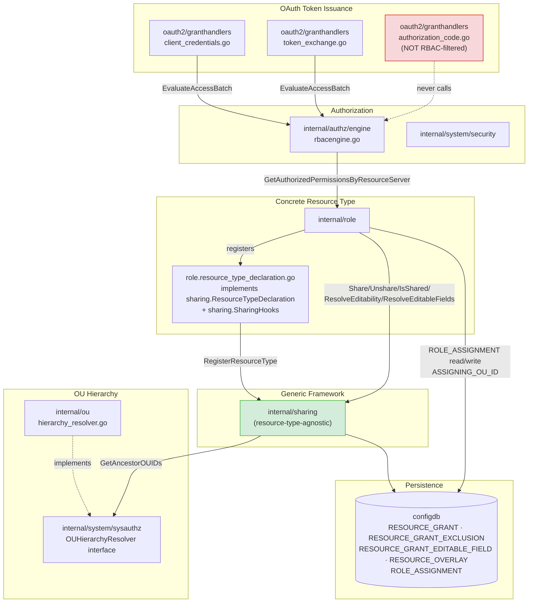

**Key structural point:** `internal/sharing` never imports `internal/role`. Role depends on
sharing, registers itself with a declaration, and optionally implements `SharingHooks` — the
dependency arrow only ever points one way. This is what makes the framework reusable for a future
second resource type without touching `internal/sharing` at all.

## 2. Data Model

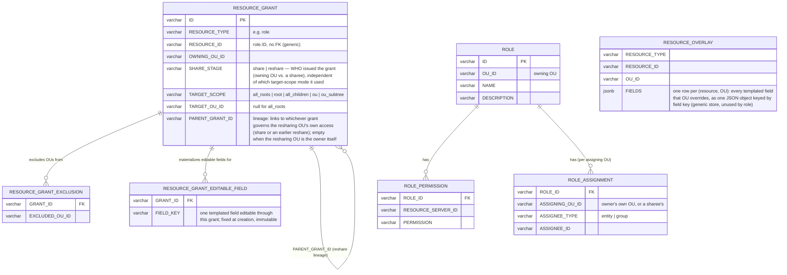

Three things worth calling out:

- `RESOURCE_GRANT.RESOURCE_ID` has **no foreign key** to `ROLE.ID` (or to any resource table) — this
  is what makes the table generic across resource types. Referential integrity for a specific
  resource type is that type's own responsibility (Role currently does not cascade-clean
  `RESOURCE_GRANT` rows on role deletion; see design doc's open items).
- `RESOURCE_GRANT_EDITABLE_FIELD` mirrors `RESOURCE_GRANT_EXCLUSION` exactly (one row per member,
  cascade-deleted with its grant) rather than a single delimited column, keeping the "is field X
  editable through this grant" check a plain membership lookup. There is deliberately no separate
  OU-wide or per-resource editability table any more — editability lives only on the grant that
  actually governs an organization unit's access (§5).
- `ROLE_ASSIGNMENT.ASSIGNING_OU_ID` is the one deliberate exception to "no per-resource-type
  sharing tables": it's Role's own pre-existing table, extended, not a new table invented for
  sharing.

## 3. Core Abstractions (`internal/sharing`)

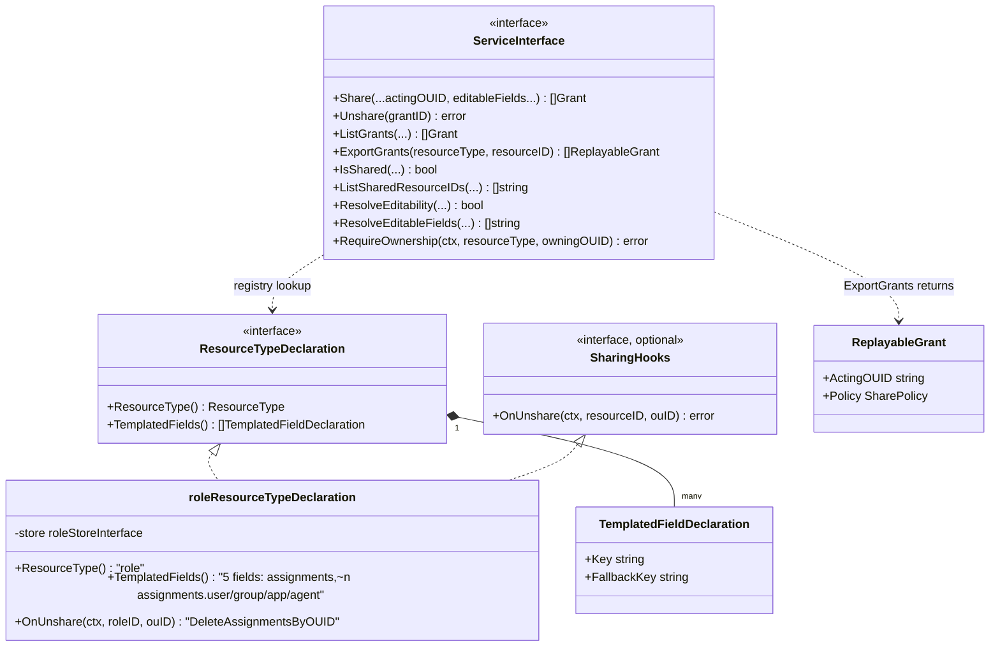

`roleResourceTypeDeclaration` (`backend/internal/role/resource_type_declaration.go`) declares five
templated fields: the blanket `assignments`, plus `assignments.user`, `assignments.group`,
`assignments.app`, `assignments.agent`, each with `FallbackKey: "assignments"`. `OnUnshare` deletes
that OU's `ROLE_ASSIGNMENT` rows the moment its grant is revoked — a sharee never keeps a stale,
permanent permission after being unshared.

## 4. Sharing Model: One Action, Two Target-Scope Modes

`Share` (`POST /roles/{id}/grants`) is a single action with two target-scope modes selected
by which fields of the request are populated: root-targeting crosses trees, children-targeting
redistributes within one. A sharee using children-targeting mode to reshare further is not a
separate action or a looser check — it is this exact same call, gated by the exact same visibility
rule, made by an `ouId` other than the resource's own owner.

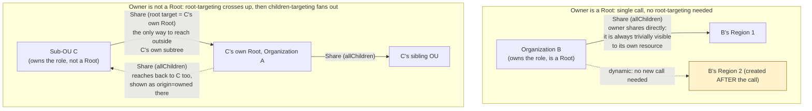

`allChildren` is **never snapshotted**. The grant row stores only the anchor OU; whether a given OU
is "in scope" is answered dynamically at read time.

### Chained Delegation: Explicit Targets Are Immediate-Children-Only

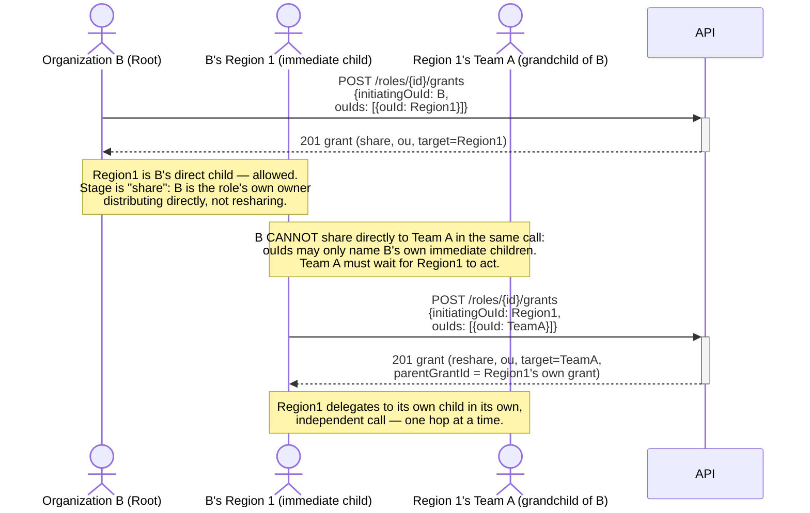

Each hop is a separate, independently-revocable grant, deliberately issued by the OU that
currently holds the resource — not something Organization B can shortcut in a single call.
`allChildren` has no such restriction: it is exempt because it already models the entire subtree,
any depth, as one relationship.

### One Named Branch, Whole: an `ouIds` entry with `allChildren`

`allChildren` can only ever anchor at the OU that issued it (`TARGET_OU_ID` is set to the acting OU),
so between "this one child" and "every branch I have" there was nothing. An OU wanting to hand a
single child the resource *for that child's entire branch* could only name the child and then wait
for the child to redistribute in a second call it does not control.

A third children-targeting scope, `ou_subtree`, closes that gap. Each `ouIds` entry is an object
naming one direct child, and its own `allChildren` flag says whether that child's subtree comes
with it. The one-hop rule is untouched — an entry may still only name a direct child — but the
grant now also anchors that child's own subtree:

| Field | `TARGET_SCOPE` | `TARGET_OU_ID` | Reaches |
|---|---|---|---|
| `ouIds: [{ouId: X}]` | `ou` | X | X alone |
| `ouIds: [{ouId: X, allChildren: true}]` | `ou_subtree` | X | X **and** every OU beneath it |
| `allChildren: true` | `all_children` | the acting OU | every OU beneath the issuer, any depth |

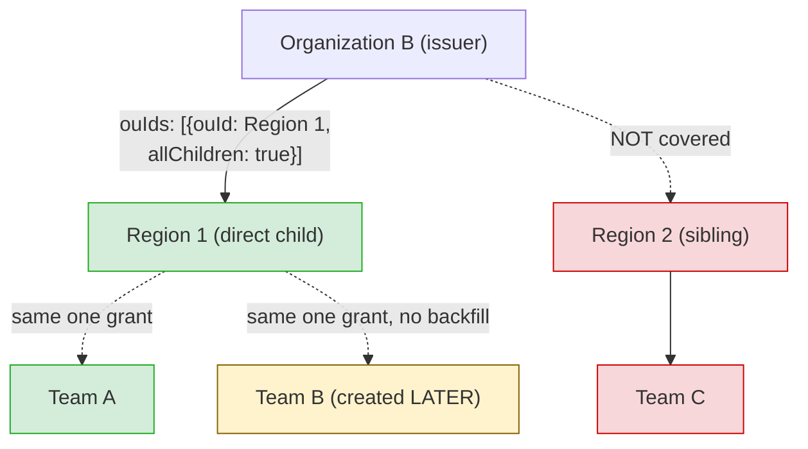

Delegation safety is unchanged: what the issuer hands over is exactly what the named child could
have granted for itself, so no authority is created that did not already exist one hop down. Like
`all_children`, the subtree is **never snapshotted** — an OU created under Region 1 tomorrow is in
scope with no new grant.

In chain evaluation (`evaluateChainVisibility`) the scope is deliberately the union of the two
existing behaviours, which is why it needed no new traversal logic: it covers its own named OU under
the same immediate-predecessor rule as an `ou` grant, and from that OU downwards it behaves exactly
as an `all_children` grant issued by that OU would, exclusions included. `excludedOuIds` therefore
works against it — an exclusion carves out that OU and everything below it. Exclusions naming an OU
outside a given subtree grant are inert rather than rejected: they can never sit between that grant's
anchor and a descendant of it, which is what lets one request carry several subtree entries and one
exclusion list without partitioning it per grant.

### Visibility Resolution — walk the chain, don't just pattern-match

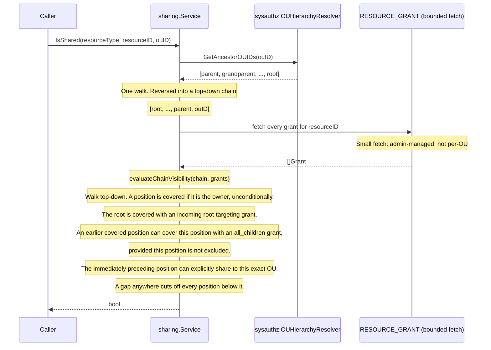

Cost per call: **one ancestor walk + one bounded fetch** (every grant for one resource, or every
grant of a type touching the caller's chain — both small, admin-managed sets), evaluated with a
short in-memory loop — never a per-grant tree walk, regardless of tree depth/breadth or grant
count. Moving evaluation into Go (rather than an ever-growing SQL condition list) is also what made
multi-hop chain integrity directly unit-testable without a database.

**Why a flat match isn't enough once delegation chains exist:** the previous version of this
diagram matched a grant directly against the caller's resolved root — correct when every reshare
was issued by a Root in one hop, but not once an intermediate OU can reshare further (previous
section). A row naming a deep OU directly must not count if the hop from its real parent was never
granted; an exclusion partway down a chain must cut off every OU below it, even one reached via an
otherwise-valid-looking deeper grant. `evaluateChainVisibility` walks the chain precisely to catch
both cases — see the design doc §5.14.

### Cross-Tree Sharing Is Restricted by Default

Root-targeting is the only mode that crosses trees, and it has two distinct shapes depending on
whether the owner sharing the resource is itself a Root:

- **Owner is a Root** sharing to another Root (ordinary Root-to-Root distribution, e.g. `03 - Share
  to Root` in the demo collection) — always allowed, never restricted by anything in this section.
- **Owner is not a Root** ("a child OU") sharing via root-targeting — this is always at least a
  push **up**, and by default it may only reach **its own tree's Root**, the first step of the
  push-to-own-root-then-reshare pattern shown in the diagram above. Reaching a **foreign** tree's
  Root directly — skipping the "push up, then the Root reshares within its own tree" two-step
  entirely — is restricted unless the deployment's
  `resource_sharing.allow_child_ou_cross_tree_sharing` setting explicitly allows it. The rejection
  (`SHR-1009`) is deliberately generic to the caller: it does not reveal the target's relationship
  to the deployment's organization structure or the existence of this setting.

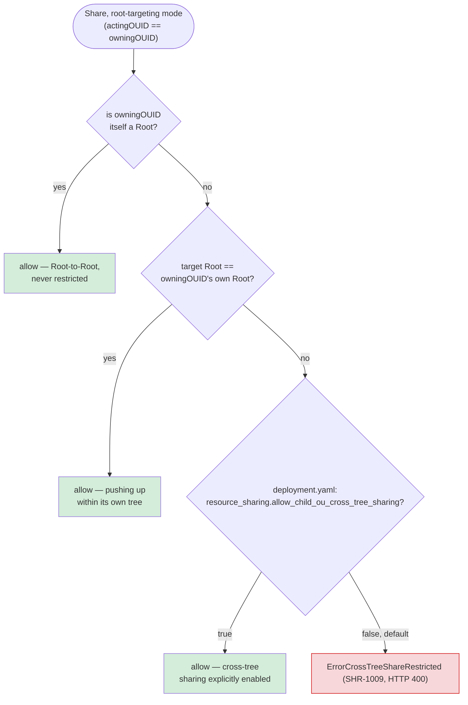

`AllRoots` mode is treated as inherently cross-tree for a non-root owner — it reaches every Root in
the deployment, foreign trees included, by definition — so a non-root owner's `AllRoots` share is
rejected outright with the same error unless the setting is enabled; there is no partial "just the
roots you'd be allowed to reach anyway" fallback.

**Deployment setting** (`deployment.yaml`, generic — applies to every resource type onboarded onto
the sharing framework, not just Role): a single static boolean, read once at startup,

```yaml
resource_sharing:
  allow_child_ou_cross_tree_sharing: true
```

Unset (or `false`) is the default and means restricted, matching this framework's deny-by-default
posture elsewhere (e.g. reshare's scope-down-only rule, §5.15 of the design doc). This is
deliberately a **static** setting (`config.Config.ResourceSharing.AllowChildOUCrossTreeSharing`,
part of the same monolithic `deployment.yaml` as `tls.min_version` or `database`), not a
runtime-mutable `internal/serverconfig` section: it changes a deployment's security posture, so
changing it is meant to be a deliberate, restart-triggering act, not a live API call. It's threaded
straight into
`sharing.Initialize(...)` from `cmd/server/servicemanager.go` and stored on the service at
construction — no `ConfigReader`/registry plumbing needed, since `internal/sharing` already reads
`config.GetServerRuntime()` synchronously at startup, unlike the runtime store (`internal/csp`/
`internal/cors`'s own config sections), which is why those two packages need the more elaborate
package-level-reader pattern in the first place.

The check itself lives entirely in `internal/sharing/service.go`'s `shareToRoots` — resolved via
`resolveOwnRootOUID` (an owner's own Root is itself if it has no ancestors, else the topmost entry
of its ancestor chain) — so any future resource type onboarded onto the framework gets the same
restriction for free, with no resource-type-specific code required.

## 5. Editability Resolution

Editability is not a separately-managed policy consulted alongside a grant — it is a property
**of** the grant itself, fixed at the moment `Share` creates it (`Grant.EditableFields`,
persisted in `RESOURCE_GRANT_EDITABLE_FIELD`). There is no "set editability" mutation endpoint at all;
changing what an organization unit may edit means revoking its grant and sharing again with a new
`editableFields` list.

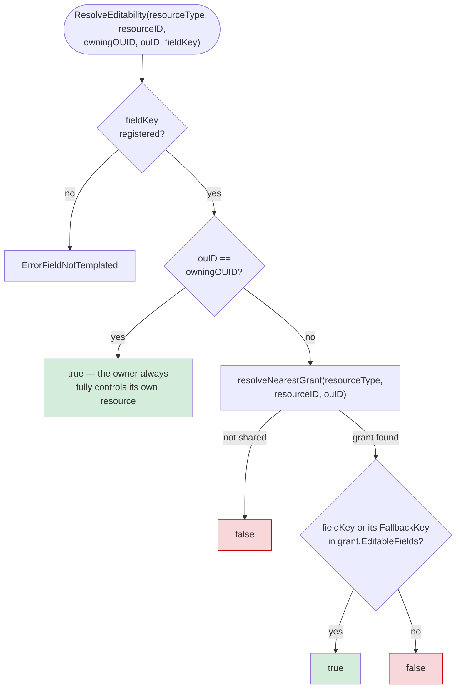

`resolveNearestGrant` is the same chain-walk `IsShared` uses (§4), returning the single grant that
actually established `ouID`'s access — **the deepest/most specific one**, not merely the first
covering grant found, when more than one grant in the chain happens to reach that OU (e.g. a broad
`allChildren` grant from the owner and a narrower reshare from a closer intermediate OU both
technically reach the same descendant). Preferring the deepest grant is what makes scope-down
(below) actually binding for descendants, not just for the OU that was directly reshared to.

**Materializing `EditableFields` at `Share` time** (`resolveGrantEditableFields` in `service.go`):

| Who is sharing (`actingOUID`) | `editableFields` omitted/empty | `editableFields` given explicitly |
|---|---|---|
| The resource's own owning OU | Every declared templated field | Exactly that list (`SHR-1006` if a name isn't declared) |
| A previously-visible sharee (reshare) | Exactly `actingOUID`'s own current editable set | Must be a subset of that set (`SHR-1008` otherwise) |

The reshare row is the scope-down invariant the feature exists to guarantee: **a reshare can only
narrow editability relative to what the resharing organization unit itself holds, never widen it.**
Because grants are immutable and this check runs once, at creation, every grant's `EditableFields`
is transitively bounded by every grant above it in its delegation chain for the rest of its
lifetime — no drift is possible without an explicit unshare/reshare.

`ResolveEditableFields(resourceType, resourceID, owningOUID, ouID)` — the metadata read backing
`GET /roles/{id}/editable-fields` — runs the identical owner-shortcut / nearest-grant logic once,
then checks every declared field's membership instead of just one, returning the full editable set
in a single call.

## 6. Core Config Is Owner-Only

Editability resolution (§5) exists because templated fields are meant to be configurable — an
owner can choose to let a sharee edit them. Core config (a role's `name`, `description`,
`permissions`) has no such dial: it is **never** editable by a sharee, full stop, no matter how the
resource type or a future admin might want to configure it. That's a deliberate difference in
kind, not degree, so it isn't modeled as a resolvable policy the way `ResolveEditability` is —
it's a single hard invariant, enforced generically for every resource type by
`ServiceInterface.RequireOwnership`/`RequireOwnershipForDeletion(ctx, resourceType, owningOUID)`:

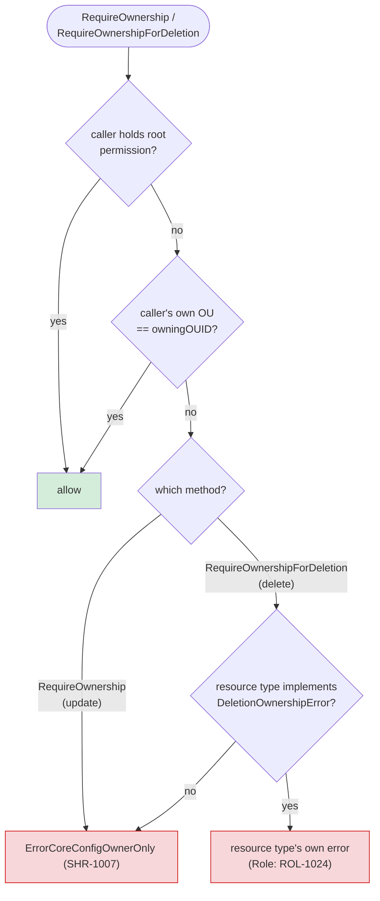

Two layers of control, deliberately redundant:

- **REST API layer.** `POST /roles`, `PUT /roles/{id}`, and `DELETE /roles/{id}` accept no
  acting-OU parameter at all — unlike `POST/GET /roles/{id}/assignments...`, which take `?ouId=` to
  select the acting (possibly sharee) OU. There is no field on these three requests a sharee could
  even populate to name itself as the acting party for core config; the only OU-shaped input on
  `POST`/`PUT` is `ouId`, and that names who will *own* the role, not who is acting on behalf of
  someone else.
- **Service layer.** `internal/role/service.go`'s `UpdateRoleWithPermissions` calls
  `RequireOwnership` against the *existing* role's `OUID` — and, when the update also moves the
  role to a different OU, against the *destination* `ouId` too, so a caller can't move a role it
  owns into an OU it doesn't own (or vice versa) — returning the generic `ErrorCoreConfigOwnerOnly`
  (SHR-1007) on mismatch. `DeleteRole` calls `RequireOwnershipForDeletion` instead, against the
  existing role's `OUID`, so a rejection surfaces the role-specific `ErrorRoleDeletionRestrictedToOwner`
  (ROL-1024) rather than SHR-1007's core-config-edit framing — deleting isn't editing. `CreateRole`
  does **not** call either — there is no existing role yet for either one's ownership framing to
  apply to, so the requested `ouId` is checked instead by `role.requireOwnOUScope` (ROL-1023), the
  same OU-reach check the read/list/assignment paths use (§7). All three are the authoritative
  check; the REST layer above is defense in depth, not a substitute for it.

Because `RequireOwnership`/`RequireOwnershipForDeletion` live on the generic `ServiceInterface`
rather than being hand-rolled in `internal/role`, any future resource type onboarded to the
sharing framework gets this guarantee for free, the same way it already gets `ResolveEditability`
and `IsShared` for free. `RequireOwnershipForDeletion`'s resource-specific error is itself an
optional capability (`DeletionOwnershipError`, checked via type assertion like `SharingHooks`) — a
resource type that doesn't implement it still gets the generic SHR-1007 on delete, so onboarding a
new resource type costs nothing extra unless it wants a more specific message.

## 7. API Access Scopes: `system` vs. `system:roles` vs. `system:roles:view`

Three OAuth scopes reach the Role Management API: `system` (the deployment's root permission —
unrestricted, as everywhere else in ThunderID), `system:roles` (full role-management access,
confined to the caller's own token-issued organization unit), and `system:roles:view` (read-only
access — list, read, and read assignments/grants/editable-fields — confined the same way).
This now matches the OU/User/Group/UserType/AgentType APIs' own view/manage split exactly: holding
`system:roles` also satisfies any `system:roles:view`-gated route (the same parent-scope rule
described below), so a full-access caller loses nothing.

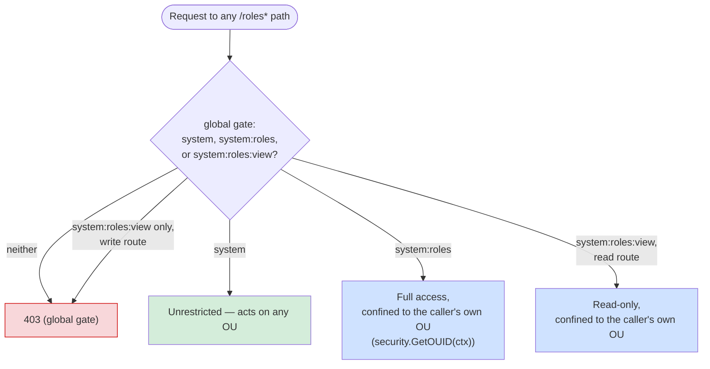

**Global gate** (`internal/system/security/permissions.go`): read routes (`GET /roles`,
`GET /roles/**`) require `system:roles:view` in `apiPermissionEntries`; write routes (`POST`, `PUT`,
`DELETE`) require the full `system:roles`. `HasSufficientPermission`'s existing parent-scope rule (a
held permission satisfies any required permission it prefixes) means a caller holding `system`, or
`system:roles` on a read route, passes the gate unchanged.

**Service-layer enforcement**, once past the gate, uses the identical "root bypasses, else caller OU
must match" rule from §6, applied by three small functions rather than one, because the OU being
checked (and, for delete, the error returned) differs by endpoint shape:

| Action | OU checked | Enforced by |
|---|---|---|
| `POST /roles` | requested `ouId` | `role.requireOwnOUScope` — no existing role yet for `sharing.RequireOwnership`'s ownership framing to apply to |
| `PUT /roles/{id}` | existing (and, on move, destination) owning OU | `sharing.RequireOwnership` (§6) |
| `DELETE /roles/{id}` | owning OU | `sharing.RequireOwnershipForDeletion` (§6) — returns role-specific `ROL-1024`, not `SHR-1007` |
| `GET /roles/{id}` | owning OU, with a shared-to-caller's-own-OU fallback | `role.requireOwnOUScope` + `IsShared` |
| `GET /roles?ouId=` | the named `ouId` | `role.requireOwnOUScope` |
| `GET /roles` (no `ouId`) | n/a — see below | handler-level branch |
| `GET/POST /roles/{id}/assignments...` | acting `ouId` (empty = role's owner) | `role.requireOwnOUScope`, additive to `IsShared`/`ResolveEditability` |

`role.requireOwnOUScope` (`internal/role/authz.go`) is `internal/role`'s own, non-generic sibling of
`sharing.RequireOwnership`: same rule, but returns `ROL-1023` rather than `SHR-1007`, since these
checks aren't about core-config ownership specifically — they're about whether the caller's scope
itself reaches the named OU at all, a distinction that matters for `GET /roles/{id}`'s shared
fallback (viewing a shared role never requires *owning* it, only that the sharing model — §3-§5 —
actually grants visibility). It applies identically regardless of which of the two non-root role
scopes the caller holds — the view/manage split is decided entirely at the global gate above, not
inside `requireOwnOUScope`.

`GET /roles` with no `ouId` reflects the caller's scope automatically rather than erroring: a
`system` caller gets the unrestricted, deployment-wide listing (unchanged); a `system:roles` or
`system:roles:view` caller is routed to the same code path as `?ouId=<its own OU>` (tagged with
`origin`), decided in `HandleRoleListRequest` by checking `security.HasSystemPermission` before
choosing which service method to call.

## 8. Authorization / RBAC Integration

### 6.1 OU-scoped assignment storage

`ROLE_ASSIGNMENT.ASSIGNING_OU_ID` records which OU wrote a given assignment row (the role's own OU
for its own assignments, a sharee's OU for one it made under a grant). The authorization hot-path
query gains exactly one optional predicate:

```sql
... WHERE ra.ASSIGNEE_TYPE = ? AND ra.ASSIGNEE_ID IN (...)
    -- AND ra.ASSIGNING_OU_ID = ?   (only added when ouID is non-empty)
```

Omitted `ouID` preserves the exact prior, deployment-wide behavior — every pre-existing caller that
never adopted OU-scoping is unaffected.

### 6.2 Client Credentials grant → RBAC → shared-role permissions (verified working)

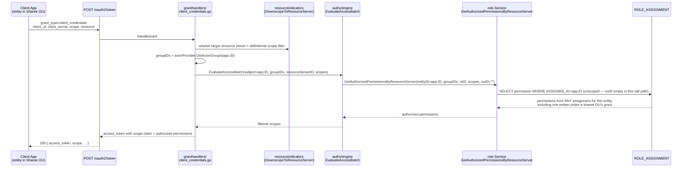

This is the concrete proof that a role shared into an OU, and assigned to an entity there, is
honored by real token issuance — not just by the sharing API's own listing/detail endpoints. It was
validated against a running instance: an application entity created directly in a sharee child OU,
assigned to the shared role via that OU's own `POST /roles/{id}/assignments/add?ouId=`, receiving a
`client_credentials` token whose `scope` (and decoded JWT payload) contained the role's permissions.

`token_exchange` follows the identical pattern through the same `EvaluateAccessBatch` call.

### 6.3 The `authorization_code` gap (not fixed, documented)

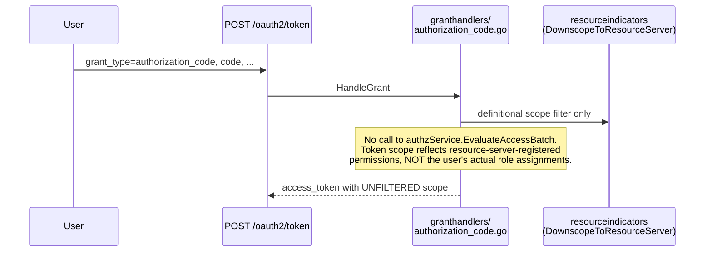

This applies identically whether the user's role is owned or shared — it is a gap in the
`authorization_code` handler generally, discovered while validating this feature, and left
unfixed by explicit decision (see design doc §5.11 and §6). Closing it would mean adding the same
`EvaluateAccessBatch` call `client_credentials`/`token_exchange` already make.

## 9. REST API Surface

| Method | Path | Kind | Notes |
|---|---|---|---|
| `GET` | `/roles` | Resource | `?ouId=` lists owned + shared, each tagged `origin` |
| `POST` | `/roles/{id}/grants` | Resource | Create a grant. `ouId` (optional, defaults to the role's owner) → root-targeting (`allRoots` \| `rootOuIds`, optional `excludedRootOuIds`, owner-only) or children-targeting (`allChildren` \| `ouIds` — `ouId`'s direct children only, optional `excludedOuIds`, any currently-visible `ouId`), plus optional `editableFields` (§5) |
| `GET` | `/roles/{id}/grants` | Resource | List a role's grants, paginated via `limit`/`offset` (`totalResults`/`startIndex`/`count`/`links`, same shape as the other role list endpoints). Declaratively declared grants are persisted like any other, so both origins appear here with nothing distinguishing them |
| `DELETE` | `/roles/{id}/grants/{grantId}` | Resource | Revoke; cascades `OnUnshare` for affected OUs |
| `GET`/`POST` | `/roles/{id}/assignments...` | Resource | `?ouId=` selects the acting OU (empty = owner) |
| `GET` | `/roles/{id}/editable-fields` | Resource | `?ouId=` (optional, defaults to the role's owner) → templated fields currently editable by that OU (§5) |
| `POST` | `/import` | Resource | A role document may include `grants` (replayed via `Share`, same shape as the grants request body) and `assignments` (one flat list, each entry's optional `ouId` naming the OU it is recorded under, replayed via `AddAssignments` after the grants), giving a full round-trip of an exported role's sharing state (§12) |
| `GET` | `/organization-units/{id}/roles`, `/organization-units/tree/{path...}/roles` | Cross-package | Lists roles owned by or shared to the OU, each tagged `origin` — the OU package's own role-listing endpoints, reached through the `OURoleResolver` adapter (`internal/role/ou_resolver.go`) rather than a direct `ROLE` table query, so they can't drift out of sync with `GET /roles?ouId=`'s own sharing-aware behavior |

Creation, listing, and revocation of grants are now a single, fully-RESTful sub-resource
collection at `/roles/{id}/grants` — there is no separate "action" endpoint for either
target-scope mode.

## 10. Caching Strategy

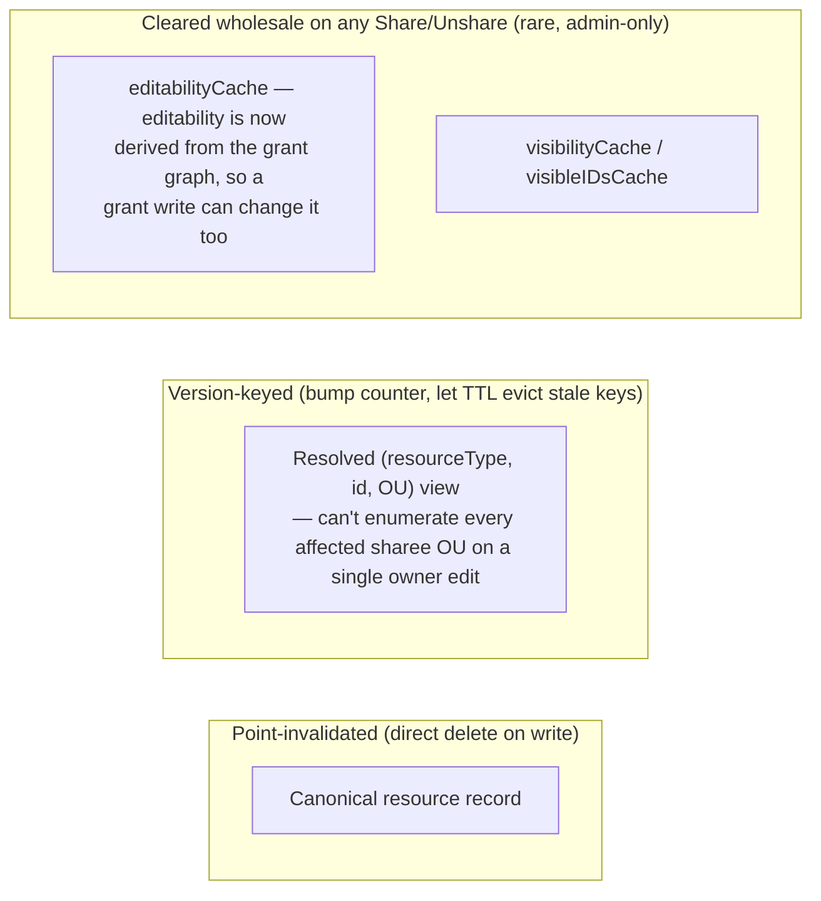

`ResolveEditability`/`ResolveEditableFields` and `IsShared`/`ListSharedResourceIDs` all share one
wholesale-clear call (`clearVisibilityCaches`, despite the name — it clears `editabilityCache` too):
a single share/reshare/unshare changes the grant graph both visibility and editability are derived
from, and can affect an unbounded number of cached keys. These writes are rare and admin-only, so a
full clear is simpler and cheaper overall than tracking exact dependency sets.

## 11. End-to-End Walkthrough

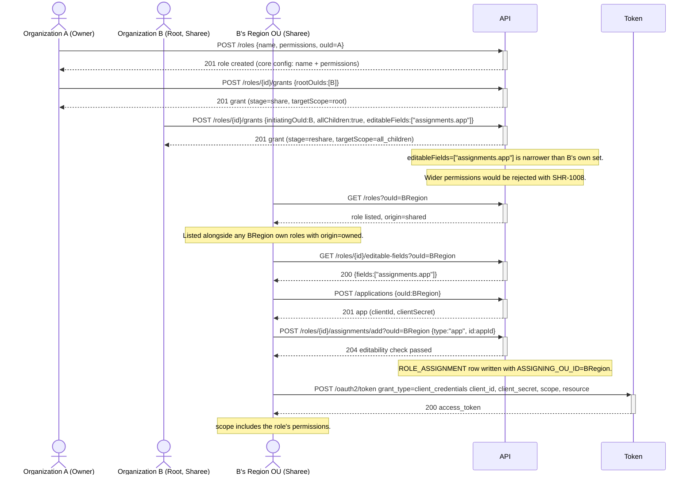

Every step above corresponds to a request in
`B2B-Reference/role-sharing/role_sharing_demo.json`, which exercises this exact flow (plus
exclusion policies, grant-scoped editability with scope-down-only reshare, and negative/
authorization cases) against a live ThunderID instance.

Two sibling collections cover the rest of the family: `B2B-Reference/resource-sharing` for sharing
the permission catalog itself, and `B2B-Reference/m2m-app-sharing` for a machine-to-machine service
that serves many organization units from one credential pair via `POST /ou/{ouId}/oauth2/token`.
That last one is designed in `B2B-Reference/B2B_M2M_APP_SHARING_DESIGN.md`, which traces where each
of the three organization units involved in such a request is consulted.

## 12. Export/Import and Declarative-YAML Grant Round-Tripping

Before this, a role's declarative export (`roleExporter.GetResourceByID`,
`backend/internal/role/declarative_resource.go`) captured core config, permissions, and the owning
OU's own assignments — but not the role's grants, nor any sharee OU's independent assignment
set. Re-importing a shared role silently dropped its entire sharing state. Declarative (file-store)
roles, meanwhile, had no way to declare a grant in YAML at all.

### Generic `ExportGrants`

`sharing.ServiceInterface.ExportGrants(ctx, resourceType, resourceID) ([]ReplayableGrant,
*tidcommon.ServiceError)` (`backend/internal/sharing/service.go`) is the sole mechanism for
reproducing a resource's sharing state elsewhere:

- It fetches every `Grant` for the resource (`ListGrants`) and topologically orders them
  via `orderGrantsByDependency`, so a reshare always sorts after the grant that made its issuing OU
  visible — the order a caller must replay them in through `Share()` for a multi-hop chain to stay
  valid at each step.
- Each ordered `Grant` converts back to a `ReplayableGrant{ActingOUID, Policy}`:
  `grantActingOUID` derives who issued the grant purely from its own stored fields (the owner for
  any share-stage grant; the anchor OU for an `all_children` reshare; the immediate parent of
  `TargetOUID` for an explicit-OU reshare — always resolvable with one ancestor lookup, since an
  explicit reshare target must be the issuer's own direct child), and `policyFromGrant` is the exact
  inverse of `shareToRoots`'/`shareToChildren`'s own grant construction.

There is deliberately **no separate "restore" primitive** bypassing `Share()`'s own checks: grant
`ID`s are generated via `utils.GenerateUUIDv7()` and were never meant to be stable, preserved
identifiers across an export/import round trip — only the shape of the grant graph matters — and
`Share()` itself has no per-caller-identity check to bypass in the first place (it only checks
structural eligibility: is `actingOUID` the owner, or already visible?). Replaying
`(ActingOUID, SharePolicy)` pairs through the ordinary `Share()` API therefore goes through the
identical validation a live API call would, and is resource-type-agnostic — it costs nothing extra
when a future resource type onboards onto the sharing framework.

### Role's declarative export additions

`roleExporter` now takes a `sharing.ServiceInterface` dependency. `GetResourceByID` populates two
sharing-aware fields on `roleDeclarativeResource`, the same struct used both for export output and
declarative-YAML parsing:

- `Grants []role.ShareRequest` (`yaml:"grants,omitempty"`): the role's grants, converted from
  `ExportGrants`' `ReplayableGrant`s via `shareRequestFromReplayableGrant`
  (`backend/internal/role/model.go`), the inverse of `ShareRequest.ToSharePolicy`. Only the YAML
  container key is new; the entry shape is the `POST /roles/{id}/grants` request body
  unchanged, and the REST *list* response already called its own array `grants`, so the YAML name
  now matches it.
- `Assignments []role.RoleAssignment` (`yaml:"assignments,omitempty"`): every assignment of the
  role, whichever OU made it, as one flat list. `roleExporter.getAssignments` walks the owning OU
  first, then each other OU returned by `RoleAssignmentServiceInterface.GetAssigningOUIDs`
  (delegating to `roleStoreInterface.GetAssigningOUIDs`, `SELECT DISTINCT ASSIGNING_OU_ID FROM
  ROLE_ASSIGNMENT WHERE ROLE_ID = ?`), and stamps each entry with the `ouId` it was found under.
  There is no separate per-sharee-OU section: a sharee OU's assignments sit in the same list as the
  owner's, distinguished only by `ouId`. That field is always written on export even though it is
  optional on import, so a round-trip reproduces the exact assigning OU rather than re-deriving it
  from where the assignee happens to live.

### Declarative YAML `grants:` support, and how a declarative assignment's OU is resolved

A role defined in a declarative YAML file (`loadDeclarativeResources`) may now declare `grants:`
inline, the identical shape as the `POST /roles/{id}/grants` request body. While parsing a
batch, the loader's `Parser` closure captures each role's `grants` into a local
`pending []pendingShare` slice (holding a pointer to the same
`*RoleWithPermissionsAndAssignments` handed to the store, so it reflects any `ouHandle`→`ouId`
resolution done during validation). Once every role in the batch has loaded successfully,
`applyPendingShares` replays each role's `grants` via `sharingService.ShareDeclarative`, in declared
order, defaulting an omitted grant's acting OU to the role's own owning OU.

`ShareDeclarative` is `Share` with the context marked, so a declared grant runs through the
identical validation an API call would — an ineligible one fails startup rather than loading
silently — but the single write point, `createGrant`, seeds it into an in-memory
`declarativeGrantStore` instead of inserting into `RESOURCE_GRANT`. That mirrors the role itself,
which lives in the file store and never reaches the database: persisting its grants alone would
append a duplicate set on every restart (`Share` does not deduplicate) and strand rows whenever the
file changed. `compositeSharingStore` merges the in-memory grants with the stored ones on every
read — `ListGrantsForResource`, `ListChildGrants`, `ListGrantsRelevantToChain` (the read behind
visibility resolution), the paged list and its count — so a declared grant resolves exactly as a
persisted one does. Writes only ever reach the database.

A declared grant is therefore immutable: `Unshare` refuses one with `SHR-1010` before firing any
`OnUnshare` hook or touching a descendant, and the composite store refuses the delete underneath it.
The role itself stays freely shareable — `POST /roles/{id}/grants` on a declaratively defined role
is accepted and persisted like any other. One consequence to know about: a reshare of something a
declared grant made visible is stored with an empty `PARENT_GRANT_ID`, because that column is a
foreign key onto `RESOURCE_GRANT` and the declared parent has no row there. `EditableFields` is
still inherited from it, so what the reshare may carry is unchanged; only the lineage link is
dropped. Removing a grant from the YAML therefore leaves any API reshare derived from it behind.

A declarative role's `assignments:` carry the same optional `ouId` as any other role's, so there is
no longer a separate section for the loader to reject, and the startup-time rejection is gone.
Between the batch loading and the pending grants being applied, `resolveLoadedAssignmentOUIDs`
fills in every loaded assignment that omitted `ouId`, via
`RoleAssignmentServiceInterface.ResolveAssignmentOUIDs` (the assignee's own OU), falling back to the
role's own OU for an assignee it cannot resolve. That stamping is purely in memory. A declarative
role still lives in the file store, whose `AddAssignments`/`RemoveAssignments`
(`backend/internal/role/file_based_store.go`) still return unconditional
`errors.New("AddAssignments is not supported in file-based store")`, so nothing is written to
`ROLE_ASSIGNMENT` and no mutable per-sharee-OU assignment set is materialized for it. What the
resolution buys is representational: a declaratively-loaded assignment reports the same assigning OU
a DB-backed one would.

### Every grant shape, in declarative YAML

The complete catalogue of what a `grants:` entry can express. Each entry maps onto one of the five
`TargetScope` values (`all_roots`, `root`, `all_children`, `ou`, `ou_subtree`) — there is no
`all_ous` for role sharing; that scope belongs to application sharing. `grants:` is a list, so a
role may carry several entries, and they are replayed in declared order.

`Share` derives `rootMode := allRoots || len(rootOuIds) > 0` and
`childrenMode := allChildren || len(ouIds) > 0`, then rejects the entry when `rootMode ==
childrenMode`. **Exactly one mode per entry** — declaring neither, or both, is `SHR-1001`.

| | Fields | Who may issue it | Reaches |
|---|---|---|---|
| 1 | `allRoots: true` | owner only | every tree's **root** OU, current and future |
| 2 | `allRoots` + `excludedRootOuIds` | owner only | same, minus the named roots and their subtrees |
| 3 | `rootOuIds: [...]` | owner only | the named root OUs |
| 4 | `allChildren: true` | owner **or** any visible sharee | every OU in the acting OU's subtree, any depth |
| 5 | `allChildren` + `excludedOuIds` | owner or visible sharee | same, minus the named OUs and their subtrees |
| 6 | `ouIds: [{ouId}]` | owner or visible sharee | the named **direct children** of the initiating OU |
| 7 | `ouIds: [{ouId, allChildren: true}]` | owner or visible sharee | that direct child **and its whole subtree**, any depth |
| 8 | a subtree entry + `excludedOuIds` | owner or visible sharee | same, minus the named OUs and their subtrees |

Root-targeting is owner-only: an entry whose acting OU is not the role's owner is rejected outright
in root mode (§4). Note that `allRoots` does **not** mean "every organization unit" — it covers
position 0 of an OU chain, the tree's root; each root then redistributes within its own tree with
its own `allChildren`/`ouIds` entry (§4's visibility walk). Every OU reference inside a grant
(`ouId`, `rootOuIds`, `ouIds`, `excludedRootOuIds`, `excludedOuIds`) is an OU **id**; only the role's
own `ouHandle` accepts a handle.

**1 — every root.** Shown as a complete document; the rest show only the `grants:` block.

```yaml
resource_type: role
id: 01900000-0000-7000-8000-000000000050
name: Support Agent
ouHandle: default
permissions:
  - resourceServerId: 01900000-0000-7000-8000-000000000020
    permissions:
      - tickets:read
grants:
  - allRoots: true
```

**2 — every root except one.** `excludedRootOuIds` is read only when `allRoots` is true, and each
entry must itself be a root.

```yaml
grants:
  - allRoots: true
    excludedRootOuIds:
      - 01900000-0000-7000-8000-0000000000b1
```

**3 — named roots.**

```yaml
grants:
  - rootOuIds:
      - 01900000-0000-7000-8000-0000000000b1
      - 01900000-0000-7000-8000-0000000000b2
```

**4 — the owner's whole subtree.** `ouId` omitted, so the acting OU is the role's own owner. One
grant covers every descendant at any depth, including OUs created later — never snapshotted (§4).

```yaml
grants:
  - allChildren: true
```

**5 — subtree minus a branch.** Excluding an OU cuts off everything beneath it: the chain walk stops
at the first exclusion between the anchor and the target.

```yaml
grants:
  - allChildren: true
    excludedOuIds:
      - 01900000-0000-7000-8000-0000000000c9
```

**6 — named direct children.** Direct children only; reaching a grandchild selectively needs a
second entry acting as that child, which is the chained-delegation rule of §4 expressed in YAML.

```yaml
grants:
  - ouIds:
      - ouId: 01900000-0000-7000-8000-0000000000c1
      - ouId: 01900000-0000-7000-8000-0000000000c2
```

**Reshare — a sharee redistributing further.** The second entry sets `initiatingOuId` to an OU that
is not the owner, making it `StageReshare`. Order is load-bearing: entries replay in declared order,
and the initiating OU must already be visible or the load fails with `SHR-1005`.

```yaml
grants:
  - ouIds:
      - ouId: 01900000-0000-7000-8000-0000000000c1
  - initiatingOuId: 01900000-0000-7000-8000-0000000000c1
    allChildren: true
```

**7 — one named branch, whole.** The named OU *and* everything beneath it, at any depth, in one
grant. Same one-hop target rule: an entry may only name a direct child of the initiating OU; its
`allChildren` decides how far the grant reaches below that child. Entries are independent, so one
child can get its whole branch while another gets only itself.

```yaml
grants:
  - ouIds:
      - ouId: 01900000-0000-7000-8000-0000000000c1    # Region 1, and everything under it
        allChildren: true
      - ouId: 01900000-0000-7000-8000-0000000000c2    # Region 2 itself, nothing below
```

**8 — a named branch minus part of itself.** `excludedOuIds` applies to a subtree entry as it does
to `allChildren`, cutting off the named OU and everything under it. An exclusion outside the branch
is inert, not an error, so one exclusion list can accompany several subtree entries.

```yaml
grants:
  - ouIds:
      - ouId: 01900000-0000-7000-8000-0000000000c1
        allChildren: true
    excludedOuIds:
      - 01900000-0000-7000-8000-0000000000d7    # a team under Region 1, held back
```

**Narrowing what a grantee may edit.** Omit `editableFields` for "everything". Valid keys are
`assignments`, `assignments.user`, `assignments.group`, `assignments.app` and `assignments.agent`;
the blanket `assignments` covers all four through its `FallbackKey` (§5). A reshare may only narrow
relative to its own set, never widen it.

```yaml
grants:
  - allChildren: true
    editableFields:
      - assignments.user
      - assignments.group
```

**Worked example — two roots, each redistributing on its own terms.** The shape most real
distributions take: the owner hands the role to several customer Roots, and each Root then decides
how far it travels inside its own tree. One file expresses the whole thing, because `ouId` selects
the acting OU per entry and entries replay in declared order.

```yaml
resource_type: role
id: 01900000-0000-7000-8000-000000000051
name: Regional Support Agent
description: Distributed to two customer organizations, each redistributing on its own terms
ouId: 01900000-0000-7000-8000-0000000000a0      # Platform (a Root), owns the role
permissions:
  - resourceServerId: 01900000-0000-7000-8000-000000000020
    permissions:
      - tickets:read
      - tickets:update
grants:
  # 1. The owner hands the role to two customer Roots. Root-targeting, owner-only.
  - rootOuIds:
      - 01900000-0000-7000-8000-0000000000b1    # Organization A
      - 01900000-0000-7000-8000-0000000000b2    # Organization B

  # 2. Organization A takes its whole subtree, any depth, including OUs created later.
  - initiatingOuId: 01900000-0000-7000-8000-0000000000b1
    allChildren: true

  # 3. Organization B takes two named direct children: Region 1 with its whole branch,
  #    Region 2 on its own.
  - initiatingOuId: 01900000-0000-7000-8000-0000000000b2
    ouIds:
      - ouId: 01900000-0000-7000-8000-0000000000c1    # B's Region 1, and everything under it
        allChildren: true
      - ouId: 01900000-0000-7000-8000-0000000000c2    # B's Region 2 alone
```

Five grants result: two `root`-scoped ones at `share` stage (the owner issued them), one
`all_children` anchored at Organization A, one `ou_subtree` anchored at B's Region 1, and one `ou`
naming B's Region 2 — the last three all `reshare`, since their initiating OU is not the role's
owner. Stage records *who issued* a grant, not whether it is traversable (§4).

Four things this example pins down:

- **Order is load-bearing.** Entries 2 and 3 are reshares, so their initiating OU must already be
  visible when they replay. `resolveNearestGrant` reads through the composite store, so it sees
  entry 1's in-memory grants — but only because they were seeded first. Moving entry 1 last fails
  the load with `SHR-1005`.
- **The owner must be a Root here.** Entry 1 names two foreign Roots. A non-root owner may only
  reach its own tree's Root, so the same file owned by a sub-OU fails with `SHR-1009` unless
  `resource_sharing.allow_child_ou_cross_tree_sharing` is enabled (§4).
- **A and B diverge permanently.** A new OU created anywhere under Organization A is covered with no
  file change, because `all_children` is evaluated dynamically and never snapshotted. A new child of
  Organization B is not covered until a fourth entry names it.
- **The two regions diverge, from one entry.** A team under Region 1 is reached, because that entry
  set `allChildren`. A team under Region 2 is not: an `ou` grant never authorizes skipping a hop, so
  reaching it needs a further entry with `initiatingOuId` set to Region 2 — the chained-delegation
  rule of §4, one hop per entry. Both targets are named in the same `ouIds` list; only the flag
  differs.

Two constraints that bite in practice: a non-root owner using `allRoots`, or naming a foreign root
in `rootOuIds`, is refused with `SHR-1009` unless `resource_sharing.allow_child_ou_cross_tree_sharing`
is enabled — reaching its own tree's root is always allowed (§4). And everything declared under
`grants:` is held in memory and immutable, so the API can add further grants to the same role but
cannot revoke a declared one.

### `POST /import` support

`roleDeclarativeYAML` (`backend/internal/system/importer/service_adapters.go`), the import-side
YAML shape (structurally identical to `roleDeclarativeResource`, but a distinct type), carries the
same `grants` and `assignments` fields. Assignments are deliberately not passed inline on the
`RoleCreationDetail` handed to `CreateRole`. After a role is created or updated via import,
`importRole` first calls `applyRoleSharing`, which replays `grants` via a narrow `sharingAdapter`
interface (`backend/internal/system/importer/service.go`, exposing only `Share`), and only then
`applyRoleAssignments`, which resolves any blank `ouId` through `ResolveAssignmentOUIDs` and makes a
single `roleAssignmentService.AddAssignments` call with no acting OU of its own, letting each
assignment's `ouId` decide where it lands. The ordering is load-bearing: an assignment recorded
under a sharee OU is only legal once that OU's grant exists. Both the create and the
upsert-update path run the same two steps in the same order. This all works for `/import`, unlike
declarative bootstrap loading, because `/import` always targets real, DB-backed roles, which do
support sharee-OU assignment writes.

Accepting an `ouId` per assignment means the acting-OU authorization can no longer be decided once
per call. `prepareAssignments` (`backend/internal/role/assignment_service.go`) therefore buckets the
incoming assignments by their effective OU via `groupAssignmentsByOU` (the assignment's own `OUID`,
else the acting OU resolved from the call), and runs the full existing gate independently for every
bucket: `requireOwnOUScope`, then, for any OU that is not the role's own, `IsShared` plus a
`ResolveEditability` check per assignee type present in that bucket. `mutateAssignments` then issues
one store call per bucket inside the single transaction. Without the per-bucket `requireOwnOUScope`,
naming an OU on an assignment would have been a way around the acting-OU scope check. The REST
assignment API is untouched by any of this: `AssignmentRequest` has no `ouId`, so
`POST /roles/{id}/assignments/add` and `.../remove` still record under the acting OU selected by
`?ouId=` exactly as before, and the assignee-OU defaulting applies only to the declarative and
import paths.

`sharingService` is an unexported field on `importService`, set by the public `Initialize(...)`
wrapper (`init.go`) after construction, rather than a `newImportService` constructor parameter —
deliberately, to avoid touching the ~80 existing positional `newImportService(...)` call sites in
tests. `newImportService`'s return type changed from the `ImportServiceInterface` interface to the
concrete `*importService` pointer to make this possible; Go's implicit interface satisfaction means
every existing caller (including wrapper functions that themselves return `ImportServiceInterface`,
converting the concrete pointer at their own `return` statement) still compiles unchanged.

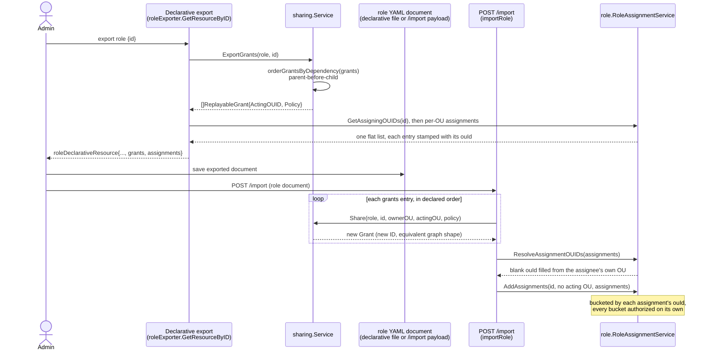

A hand-authored declarative `grants:` entry, an exported grant, and a live `POST
/roles/{id}/grants` call are indistinguishable to the sharing framework — all three end up
calling the identical `Share()` method.
